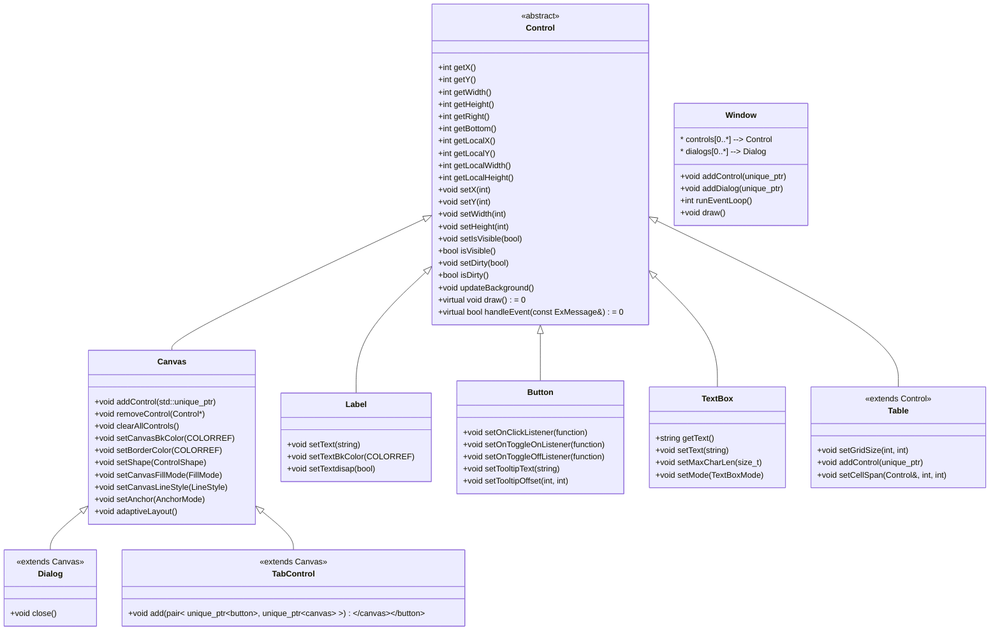

# StellarX GUI 框架控件 API 文档 (StellarX GUI Framework Controls API Documentation)

## Control 类 (抽象基类)

**描述：** `Control` 是所有控件的抽象基类，定义了通用的属性和接口，包括位置、尺寸、可见性、重绘标记等基础功能。它提供绘图状态的保存与恢复机制，确保控件的绘制操作不影响全局绘图状态。此外还声明了一系列供子类实现的纯虚函数（如 `draw()` 和 `handleEvent()`），并禁止拷贝（支持移动语义）以防止意外的复制开销。一般情况下，`Control` 不直接实例化，而是作为其他具体控件的父类存在。

**Description:** `Control` is the abstract base class for all controls, defining common properties and interfaces such as position, size, visibility, and the “dirty” flag for redraw. It provides mechanisms to save and restore drawing state to ensure a control’s drawing operations do not affect the global canvas state. It also declares a set of pure virtual functions for subclasses to implement (e.g. `draw()` for rendering and `handleEvent()` for event handling), and it disables copying (but supports move semantics) to prevent accidental heavy copy operations. Typically, `Control` is not instantiated directly; it serves as a base class for concrete controls.

**特性 (Features):**

- 定义控件的基本属性（坐标、尺寸、脏标记等）并提供对应的存取方法 *(Defines basic properties of a control – position, size, “dirty” redraw flag, etc. – and provides getters/setters for them.)*
- 提供绘图状态管理接口（如 `saveStyle()` / `restoreStyle()`）用于在控件绘制前后保存和恢复全局画笔状态 *(Provides drawing state management (e.g. `saveStyle()` / `restoreStyle()`) to save and restore the global drawing state before and after control rendering.)*
- 声明纯虚函数接口，如 `draw()`（绘制控件）和 `handleEvent()`（处理事件），所有具体控件都需实现 *(Declares pure virtual functions such as `draw()` (to draw the control) and `handleEvent()` (to handle input events), which all concrete control subclasses must implement.)*
- 禁止拷贝构造和赋值（但支持移动语义），防止控件被不小心复制 *(Copy construction and assignment are disabled (move semantics are supported) to prevent unintended copying of controls.)*



*(上述类图展示了 Control 类体系的继承关系。其中 Window 并非 Control 的子类，但它包含并管理多个 Control 对象。MessageBox 为对话框的工厂类，未在图中展示。/ The above class diagram shows the inheritance hierarchy of the Control system. Note that `Window` is not a subclass of `Control`, but contains and manages multiple Control objects. `MessageBox` is a utility factory class for dialogs and is not shown in the diagram.)*

### 公共成员函数 (Public Member Functions)

#### Control::getX() / getY() / getWidth() / getHeight()

- **用途：** 获取控件的全局坐标位置（左上角 `x, y`）或当前尺寸（宽度、高度）。

- **Purpose:** Returns the control’s global position (coordinates of its top-left corner) or its current size (width and height).

- **参数：** 无。

- **Parameters:** None.

- **返回值：** 分别返回控件的全局 X 坐标、全局 Y 坐标、当前宽度和高度，类型均为 `int`。

- **Return:** The control’s global X coordinate, global Y coordinate, current width, and height, respectively (each as an `int`).

- **行为细节：** 这些方法提供控件在应用窗口坐标系下的位置和大小，通常用于布局计算或调试。注意，全局坐标是相对于整个应用窗口的原点 (0,0)。

- **Details:** These methods give the control’s position and size in the application’s coordinate system (window coordinates). They are often used for layout calculations or debugging. Note that the global coordinates are relative to the application window’s origin (0,0).

- **示例:** 取得控件的位置和高度：

  ```
  int x = ctrl.getX();
  int h = ctrl.getHeight();
  std::cout << "Control at X = " << x << ", height = " << h << std::endl;
  ```

#### Control::getRight() / getBottom()

- **用途：** 获取控件右边缘的 X 坐标 (`getRight()`) 和底边缘的 Y 坐标 (`getBottom()`)，以全局坐标计算。

- **Purpose:** Returns the X coordinate of the control’s right edge (`getRight()`) and the Y coordinate of its bottom edge (`getBottom()`), in global coordinates.

- **参数：** 无。

- **Parameters:** None.

- **返回值：** 控件右边缘的全局 X 坐标、底边缘的全局 Y 坐标，类型为 `int`。

- **Return:** The control’s right-edge X coordinate and bottom-edge Y coordinate in global coordinates (both `int`).

- **行为细节：** 这两个方法相当于 `getX() + getWidth()` 和 `getY() + getHeight()`，用于方便地获取控件在窗口坐标系中所覆盖的边界位置。

- **Details:** These are convenience methods equivalent to `getX() + getWidth()` and `getY() + getHeight()`, respectively, to easily determine the boundaries of the control in window coordinates.

- **示例:** 判断光标是否在控件矩形范围内：

  ```
  if (cursorX < ctrl.getRight() && cursorY < ctrl.getBottom()) {
      // Cursor is within ctrl's bounding box
  }
  ```

#### Control::getLocalX() / getLocalY() / getLocalWidth() / getLocalHeight()

- **用途：** 获取控件相对于**父容器**坐标系的位置 (`LocalX, LocalY`) 以及在父容器内的尺寸 (`LocalWidth, LocalHeight`)。

- **Purpose:** Returns the control’s position relative to its **parent container** (`LocalX, LocalY`) and its size within the parent container (`LocalWidth, LocalHeight`).

- **参数：** 无。

- **Parameters:** None.

- **返回值：** 控件在父容器中的 X 坐标、Y 坐标，以及宽度、高度，类型均为 `int`。

- **Return:** The control’s X and Y coordinates within its parent container, and its width and height in that container, all as `int`.

- **行为细节：** 当控件被添加到某个容器（例如 `Canvas`）时，其本地坐标是以该容器的左上角为原点计算的。如果控件没有父容器（直接隶属于窗口），那么本地坐标等同于全局坐标。这些方法对于在容器内部进行控件布局计算非常有用。

- **Details:** If a control is added to a container (e.g. a `Canvas`), its local coordinates are measured from the top-left corner of that container. If the control has no parent container (i.e. it belongs directly to the Window), then its local coordinates are the same as its global coordinates. These methods are useful for layout calculations inside a container.

- **示例:** 获取子控件的本地和全局 X 坐标：

  ```
  int localX  = childCtrl.getLocalX();
  int globalX = childCtrl.getX();
  std::cout << "Child global X: " << globalX 
            << ", local X in parent: " << localX << std::endl;
  ```

#### Control::setX(int x) / setY(int y) / setWidth(int w) / setHeight(int h)

- **用途：** 设置控件的全局坐标位置（左上角的 X 或 Y）或调整控件的尺寸（宽度或高度）。

- **Purpose:** Sets the control’s global position (X or Y coordinate of its top-left corner) or adjusts the control’s size (width or height).

- **参数：** `x` 或 `y` 为新的全局横坐标或纵坐标；`w` 为新的宽度；`h` 为新的高度（类型均为 `int`）。

- **Parameters:** `x` or `y` is the new global X or Y coordinate; `w` is the new width; `h` is the new height (all of type `int`).

- **返回值：** 无。

- **Return:** None.

- **行为细节：** 调用这些方法将直接修改控件的位置或大小，并自动将控件标记为“需要重绘”（`dirty` 标志会被置为 `true`），使得在下一次刷新时控件会按照更新后的位置或尺寸重绘。若控件位于某容器中，设置全局坐标会改变它在窗口中的位置，同时其相对父容器的位置也会相应更新。调整尺寸可能需要控件自身处理其内容布局。

- **Details:** These methods immediately update the control’s position or size and mark the control as “dirty” (needs redraw) so that it will be redrawn at the new position or size on the next refresh cycle. If the control is inside a container, changing its global coordinates will move its position within the window, and the control’s local position relative to the parent container will also update accordingly. Resizing a control might require the control to re-layout its content (if applicable).

- **示例:** 将控件移动到窗口坐标 (100, 100) 并将宽度调整为 200：

  ```
  ctrl.setX(100);
  ctrl.setY(100);
  ctrl.setWidth(200);
  // 高度保持不变，如需调整高度也可调用 ctrl.setHeight(newH);
  ```

#### Control::isVisible() / setIsVisible(bool visible)

- **用途：** 获取或设置控件的可见状态。当设置为不可见时，控件将不再绘制也不响应事件。

- **Purpose:** Gets or sets the control’s visibility. If a control is set to invisible, it will no longer be drawn or respond to events.

- **参数：** `visible` 为布尔值，`true` 表示控件可见，`false` 表示隐藏控件。

- **Parameters:** `visible` is a boolean; `true` to make the control visible, or `false` to hide it.

- **返回值：** `isVisible()` 返回 `bool`，表示当前可见状态；`setIsVisible()` 无返回值。

- **Return:** `isVisible()` returns a `bool` indicating the current visibility state; `setIsVisible()` returns nothing.

- **行为细节：** 隐藏控件相当于将其 `visible` 状态置为 false，并触发重绘逻辑：被隐藏时控件内容将不再绘制；再次显示（visible=true）时控件会被标记为需要重绘。对于容器控件（如 `Canvas`），该方法被重写以**递归地影响其子控件**：隐藏一个容器时，其所有子控件也随之隐藏；再次显示容器时，子控件也一并显示。

- **Details:** Hiding a control sets its internal visibility to false and triggers the repaint logic: when hidden, the control’s content is not drawn; when made visible again, the control is marked dirty for redraw on the next frame. For container controls (e.g. `Canvas`), this method is overridden to **affect all child controls recursively**: hiding a container will hide all its children; showing the container again will also show its children.

- **示例:**

  ```
  button.setIsVisible(false);  // Hide the button
  // ... some operations ...
  button.setIsVisible(true);   // Show the button again
  ```

#### Control::setParent(Control* parent)

- **用途：** 设置控件的父容器指针。通常由容器在添加子控件时自动调用，用户很少需要手动调用此函数。

- **Purpose:** Sets the parent container pointer of the control. This is usually called internally when a container adds a child control, and users rarely need to call it manually.

- **参数：** `parent` 为指向新的父容器控件（如 `Canvas` 等）的指针。传入 `nullptr` 则清除父容器关联。

- **Parameters:** `parent` is a pointer to the new parent container (e.g. a `Canvas`). Pass `nullptr` to clear the parent association.

- **返回值：** 无。

- **Return:** None.

- **行为细节：** 此方法将内部的父指针设置为指定容器，并相应地改变控件坐标解释方式（有父容器时，本地坐标相对于父容器计算）。当使用容器的 `addControl()` 将控件添加到某容器时，框架内部会自动调用该函数，无需用户干预。**注意：** 如果需要将控件从一个容器转移到另一个容器，除了调用 `setParent()` 之外，还必须在旧容器中移除控件并在新容器中添加控件，否则界面状态将不一致。

- **Details:** This method sets the control’s internal `parent` pointer to the given container and changes how the control’s coordinates are interpreted (with a parent, local coordinates are relative to the parent’s origin). The framework automatically calls this when adding a control to a container via the container’s `addControl()` method, so manual use is seldom needed. **Note:** To move a control from one container to another, you must not only call `setParent()` but also remove the control from the old container and add it to the new one (e.g. via the containers’ `removeControl()` and `addControl()`), otherwise the UI state will be inconsistent.

- **示例:** 将控件从一个 Canvas 转移到另一个：

  ```
  canvas1.addControl(std::move(ctrl));    // internally calls ctrl.setParent(&canvas1)
  // ... later, to move ctrl from canvas1 to canvas2:
  canvas1.removeControl(ctrlPtr);
  canvas2.addControl(std::move(ctrlPtr)); // internally calls ctrl.setParent(&canvas2)
  ```

#### Control::setDirty(bool dirty)

- **用途：** 手动设置控件的“需要重绘”标记。当控件的内容或属性改变但没有自动标记时，可调用此函数要求框架在下次刷新时重绘该控件。

- **Purpose:** Manually marks the control as “dirty” (needing redraw). If a control’s content or properties change and it is not automatically flagged, this function can be used to request the framework to redraw the control on the next update.

- **参数：** `dirty` 布尔值；传入 `true` 标记控件需要重绘，传入 `false` 清除重绘标记。

- **Parameters:** `dirty` (bool); pass `true` to mark the control for redraw, or `false` to clear the redraw flag.

- **返回值：** 无。

- **Return:** None.

- **行为细节：** 将控件标记为需要重绘 (`dirty = true`) 后，在随后的屏幕刷新循环中，系统将调用该控件的 `draw()` 方法进行重新绘制。通常在更改控件状态后框架会自动标记脏区，无需用户手动调用；但某些情况下（如自定义控件内部状态改变），可通过此方法强制刷新。

- **Details:** After marking a control as dirty (`true`), the framework will invoke the control’s `draw()` on the next refresh to redraw it. Typically, changing a control’s state will automatically mark it dirty, so manual calls are seldom required; however, in some cases (e.g. custom control internal state changes), this method can be used to force a refresh.

- **示例:**

  ```
  // After updating some internal state of the control:
  ctrl.setDirty(true);  // request to redraw this control on next frame
  ```

#### Control::updateBackground()

- **用途：** 释放之前保存的背景快照并重新捕获当前背景，用于在控件尺寸变化或内容变化后更新其背景缓存。调用此函数可确保控件背景的正确性，避免因为尺寸变化导致的背景错位。

- **Purpose:** Discards the previously saved background snapshot and captures the current background behind the control. This is used to update the control’s cached background after its size or content changes, ensuring the control’s background is correct and avoiding misaligned backgrounds due to size changes.

- **参数：** 无。

- **Parameters:** None.

- **返回值：** 无。

- **Return:** None.

- **行为细节：** 缺省实现中，`updateBackground()` 先丢弃旧的背景位图（相当于调用内部的 `discardBackground()`），然后在控件新位置和尺寸范围内重新保存一份背景快照。通常在控件大小改变或需要重绘时会自动调用，一般不需要用户手动调用。对于某些自定义控件，在调整大小后可显式调用此方法以刷新背景。

- **Details:** In the default implementation, `updateBackground()` will discard the old background bitmap (essentially calling an internal `discardBackground()`), then capture a fresh snapshot of the background under the control’s current position and new size. This is usually called automatically when a control’s size changes or a redraw is needed, so manual calls are generally not required. In custom controls, you might call this after resizing to refresh the background.

- **示例：** 在自定义控件调整尺寸后更新其背景：

  ```
  myControl.setWidth(newW);
  myControl.setHeight(newH);
  myControl.updateBackground();
  ```

#### Control::draw() (纯虚函数)

- **用途：** 绘制控件的抽象接口，由具体控件类实现实际的绘图逻辑。
- **Purpose:** Abstract interface for drawing the control, to be implemented by concrete control classes with the actual rendering logic.
- **参数：** 无（绘制所需信息由控件的内部状态确定）。
- **Parameters:** None (drawing is based on the control’s internal state).
- **返回值：** 无。
- **Return:** None.
- **行为细节：** `draw()` 通常由框架在重绘时自动调用，具体控件应在此方法中完成自身内容的绘制。实现时应首先检查控件是否需要绘制（如是否可见、是否脏），然后保存当前绘图状态（如颜色、裁剪区域等），再进行绘制，结束后恢复绘图状态。大多数控件的实现会调用 `Control::saveStyle()` 和 `Control::restoreStyle()` 来保护全局状态。
- **Details:** The `draw()` method is typically called by the framework when a redraw is required. A concrete control class should implement this to render its content. Implementations should usually check whether the control needs drawing (e.g. visible and dirty flags), then save the current global drawing state (colors, clipping, etc.), perform the control-specific drawing, and finally restore the previous drawing state. Most control implementations will use `Control::saveStyle()` and `Control::restoreStyle()` to preserve the global state during drawing.

#### Control::handleEvent(const ExMessage& msg) (纯虚函数)

- **用途：** 处理输入事件的抽象接口，由具体控件类实现实际的事件响应逻辑。

- **Purpose:** Abstract interface for handling input events, to be implemented by concrete controls with their event response logic.

- **参数：** `msg`，事件消息结构 (`ExMessage`)，包含鼠标、键盘等输入事件的信息。

- **Parameters:** `msg` – an event message (`ExMessage`), containing information about input events (mouse, keyboard, etc.).

- **返回值：** `bool`，指示事件是否被该控件消费处理。返回 `true` 表示事件已被处理（不需要向其他控件继续传递），返回 `false` 则表示控件未处理该事件。

- **Return:** `bool` indicating whether the event was handled/consumed by this control. Returns `true` if the event was handled (and should not propagate further to other controls), or `false` if this control did not handle the event.

- **行为细节：** 框架在捕获到用户输入事件时，会依次将事件传递给窗口内各控件的 `handleEvent()` 方法。每个控件实现应根据事件类型和自身状态决定是否处理该事件。如果控件对事件作出了响应（例如按钮检测到点击），应执行相应逻辑并返回 `true`，否则返回 `false` 让框架继续将事件传递给其他控件。通常情况下，容器控件会先让其子控件有机会处理事件，再根据需要进行额外处理。

- **Details:** When the framework captures an input event, it passes it to each control’s `handleEvent()` in turn. Each control’s implementation should determine whether to act on the event based on the event type and the control’s state. If the control responds to the event (e.g. a Button detects a click inside its bounds), it should perform the appropriate action and return `true`. If not, it returns `false` so the framework knows to continue propagating the event to other controls. Container controls typically give their child controls a chance to handle the event first, and then perform any additional handling if needed.

- **示例：** 在事件循环中检查事件处理结果：

  ```
  ExMessage msg;
  // ... get message from system (via peekMessage) ...
  if (ctrl.handleEvent(msg)) {
      // The event was handled by ctrl, no further processing
  }
  ```

#### Control::setLayoutMode(StellarX::LayoutMode layoutMode_)

- **用途：** 设置控件的布局模式。

- **Purpose:** Set the layout mode of the control.

- **参数：** `layoutMode_`，`StellarX::LayoutMode` 枚举值，定义了两种布局模式：`Fixed`（固定布局）和 `AnchorToEdges`（锚点布局）。默认为固定布局。当布局模式为锚点布局时，根据设置的锚点不同，控件在窗口拉伸时会自动调整位置或尺寸。

- **Parameters:** `layoutMode_` is a value from the `StellarX::LayoutMode` enum defining two layout modes: `Fixed` layout and `AnchorToEdges` anchor layout. By default, controls use Fixed layout. When the layout mode is AnchorToEdges, the control will automatically adjust its position or size when the window is resized, according to the specified anchors.

- **返回值：** 无。

- **Return:** None.

- **行为细节：** 当希望某个控件在窗口某一边或者两边与容器的距离保持不变时，可以将其布局模式设置为锚定布局，并通过锚点参数指定锁定的边。设置为固定布局则表示窗口拉伸时控件不自动调整。此函数调用会更新控件内部的布局模式标志。

- **Details:** Use anchor layout mode when you want a control’s distance to one or two edges of its parent (window or container) to remain constant as the window resizes. In anchor mode, the control may move or stretch when the parent is resized, depending on which edges are anchored. Fixed layout (the default) means the control will not move or resize automatically on window resize. Calling this function updates the control’s internal layout mode setting.

- **示例:** 设置控件的布局模式：

  ```
  button.setLayoutMode(StellarX::LayoutMode::Fixed);          // 固定模式
  button.setLayoutMode(StellarX::LayoutMode::AnchorToEdges);  // 锚点模式
  ```

#### Control::steAnchor(StellarX::Anchor anchor_1, StellarX::Anchor anchor_2)

- **用途：** 设置控件的锚点（Anchor）。仅当布局模式为 `AnchorToEdges` 时生效。通过传入两个锚点常量，将控件锁定在父容器的相应边缘或同时锁定两侧。

- **Purpose:** Set the anchor points of the control. This takes effect only when the layout mode is `AnchorToEdges`. By specifying up to two anchor constants, the control can be fixed to corresponding edges of the parent container (one horizontal and/or one vertical edge).

- **参数：** `anchor_1`，`anchor_2`：锚点常量，取值为 `StellarX::Anchor` 枚举的值，包括 `Top`（顶边）, `Bottom`（底边）, `Left`（左边）, `Right`（右边）以及 `NoAnchor`（不锚定）。可以传入一个或两个不同方向的锚点（如一个水平锚点加一个垂直锚点）。如果传入 `NoAnchor`，则表示不在对应方向锚定。

- **Parameters:** `anchor_1` and `anchor_2` are constants from the `StellarX::Anchor` enum: possible values are `Top`, `Bottom`, `Left`, `Right`, or `NoAnchor`. You may provide one or two anchors (typically one horizontal and one vertical) to lock the control’s sides. Providing `NoAnchor` for an argument means no anchor on that axis.

- **返回值：** 无。

- **Return:** None.

- **行为细节：** 当控件布局模式为锚定时，锚点设定决定了窗口或容器大小变化时控件的调整行为。例如锚定 `Top` 和 `Bottom` 则控件在垂直方向随容器高度伸展；锚定 `Left` 和 `Right` 则在水平方向随容器宽度伸展；锚定单一边（如 `Top`）则控件保持与容器顶边距离不变。一般应选择最多两个正交方向的锚点进行组合。如果锚点未设置（或为 `NoAnchor`），控件在该方向不随父容器变化。

- **Details:** When using anchor layout, the specified anchors determine how the control reacts to parent size changes. For example, anchoring to `Top` and `Bottom` will make the control stretch vertically with the container’s height; anchoring to `Left` and `Right` will stretch it horizontally with the container’s width. Anchoring to only one edge (e.g. `Top`) means the control stays a fixed distance from that edge and does not resize along that axis. Typically you choose up to two perpendicular edges to anchor. If an anchor is not set (or `NoAnchor`), the control will not adjust on that axis when the parent resizes.

- **示例:** 设置控件同时锚定在容器上下边缘或左右边缘：

  ```
  button.setLayoutMode(StellarX::LayoutMode::AnchorToEdges);  
  button.steAnchor(StellarX::Anchor::Top, StellarX::Anchor::Bottom);   // 同时锚定上下（垂直方向随容器改变）
  // 或锚定左右：
  button.steAnchor(StellarX::Anchor::Left, StellarX::Anchor::Right);   // 同时锚定左右（水平方向随容器改变）
  ```

#### Control::getAnchor_1() / getAnchor_2() / getLayoutMode()

- **用途：** 获取控件当前设置的第一个锚点、第二个锚点，以及布局模式。

- **Purpose:** Returns the control’s currently set first anchor, second anchor, and layout mode.

- **参数：** 无。

- **Parameters:** None.

- **返回值：** `getAnchor_1()` 和 `getAnchor_2()` 返回 `StellarX::Anchor` 枚举值，表示控件锚定的两个边（如果未设置则可能返回 `NoAnchor`）。`getLayoutMode()` 返回 `StellarX::LayoutMode` 枚举值，表示控件的布局模式（固定或锚定）。

- **Return:** `getAnchor_1()` and `getAnchor_2()` return a `StellarX::Anchor` value indicating which edges the control is anchored to (returns `NoAnchor` if none set on that slot). `getLayoutMode()` returns a `StellarX::LayoutMode` value indicating the control’s current layout mode (Fixed or AnchorToEdges).

- **行为细节：** 当控件布局模式为固定时，锚点设置通常为 `NoAnchor`（不生效）；当布局模式为锚定时，这两个锚点值决定控件如何响应容器尺寸变化。开发者可通过这些方法查询控件的布局设定，以便在调整布局或调试时使用。

- **Details:** If the control’s layout mode is Fixed, the anchor values will typically be `NoAnchor` (not used). In AnchorToEdges mode, the two anchor values determine how the control responds to parent size changes. These getters allow developers to query the control’s layout configuration, which can be useful for adjusting layouts or debugging.

- **示例:** 检查一个控件是否使用锚定布局：

  ```
  if (ctrl.getLayoutMode() == StellarX::LayoutMode::AnchorToEdges) {
      std::cout << "Anchors: " 
                << ctrl.getAnchor_1() << " and " 
                << ctrl.getAnchor_2() << std::endl;
  }
  ```

### 私有成员函数 (Private/Protected Member Functions)

*(Control 类的大部分私有函数仅供框架内部使用。例如，Control 内部有辅助函数如 `saveStyle()` 和 `restoreStyle()`（用于保存和恢复绘图状态）以及 `discardBackground()`（用于背景管理），还有被禁止的拷贝构造函数等。这些内部接口不对外公开，开发者通常不需要直接调用。/ Most private functions of the Control class are for internal framework use only. For instance, Control has helper functions like `saveStyle()` and `restoreStyle()` for preserving drawing state, `discardBackground()` for background management, and a deleted copy constructor to prevent copying. These internal interfaces are not exposed publicly, and developers do not normally call them directly.)*

## Canvas 类 (画布容器控件)

**描述：** `Canvas` 是一个容器控件，用于分组和管理多个子控件。它作为其他控件的父容器存在，为子控件提供统一的背景和边框样式。Canvas 负责将输入事件传递给其包含的子控件，并按照添加顺序绘制子控件。它本身也继承了 Control 的属性，可以设置背景颜色、边框和形状等。通常用于实现复杂布局或作为对话框等的基础容器。

**Description:** `Canvas` is a container control used for grouping and managing multiple child controls. It acts as a parent for other controls, providing a unified background and border style for its children. The Canvas propagates input events to the controls it contains and draws its child controls in the order they were added. It inherits properties from `Control` and allows customization of background color, border, shape, etc. Canvas is typically used to create complex layouts or serve as a base container for dialogs and other composite interfaces.

**特性 (Features):**

- 支持四种矩形形状（普通矩形、圆角矩形，以上各有边框和无边框版本） *(Supports four rectangle shape variants (standard rectangle and rounded rectangle, each with bordered and borderless options).)*
- 可自定义填充模式、边框颜色和背景颜色 *(Customizable fill mode, border color, and background color.)*
- 自动管理子控件的生命周期和事件传递 *(Automatically manages the lifetime of child controls and propagates events to them.)*
- 支持嵌套容器结构（Canvas 内可再包含 Canvas 等） *(Supports nested container structures (a Canvas can contain other Canvas controls, etc.).)*

### 公共成员函数 (Public Member Functions)

#### Canvas::Canvas(int x, int y, int width, int height)

- **用途：** Canvas 构造函数，创建一个指定位置 (`x, y`) 和尺寸 (`width x height`) 的空白画布容器。

- **Purpose:** Constructor for a Canvas. Creates a blank canvas container at the specified position (`x, y`) with the given width and height.

- **参数：** `x`, `y` 为画布左上角的初始坐标；`width`, `height` 为画布初始宽度和高度。

- **Parameters:** `x`, `y` are the initial coordinates of the canvas’s top-left corner; `width`, `height` are the canvas’s initial width and height.

- **返回值：** 无（构造函数）。

- **Return:** None (constructor).

- **行为细节：** 新建的 Canvas 默认具有无填充、无边框的矩形形状背景（具体取决于默认设置），且初始状态下没有任何子控件。构造后可以使用 `addControl()` 方法向其中添加子控件。Canvas 默认可见，除非显式调用 `setIsVisible(false)`。

- **Details:** The newly created Canvas defaults to a rectangular background (with default fill and no border unless otherwise specified) and initially contains no child controls. After construction, you can add child controls to it using `addControl()`. The Canvas is visible by default unless you explicitly hide it with `setIsVisible(false)`.

- **示例:** 创建一个大小为 300x200 的画布并添加子控件：

  ```
  Canvas panel(10, 10, 300, 200);
  panel.setCanvasBkColor(RGB(240, 240, 240));  // 浅灰背景
  panel.setBorderColor(BLACK);
  panel.setLinewidth(1);
  panel.addControl(std::make_unique<Label>(50, 50, "Hello", BLACK));
  ```

#### Canvas::draw()  (重写自 Control)

- **用途：** 绘制 Canvas 背景并递归绘制其包含的子控件。
- **Purpose:** Renders the Canvas background and then draws all the child controls contained within it (recursively).
- **参数：** 无。
- **Parameters:** None.
- **返回值：** 无。
- **Return:** None.
- **行为细节：** Canvas 的 `draw()` 实现会先绘制自身的背景（根据设置的背景颜色、填充模式以及边框样式绘制一个矩形或圆角矩形区域）。然后，Canvas 按照子控件添加的顺序调用每个子控件的 `draw()` 方法进行绘制。绘制时会确保将绘图剪辑限制在 Canvas 区域内，以免子控件绘制越界。
- **Details:** The Canvas’s `draw()` implementation first draws its own background (filling a rectangle or rounded rectangle area with the configured background color or pattern, and drawing the border if applicable). It then iterates through its child controls in the order they were added, calling each child’s `draw()` method to render them. The rendering is typically clipped to the Canvas’s area to prevent children from drawing outside the canvas bounds.

#### Canvas::handleEvent(const ExMessage& msg)  (重写自 Control)

- **用途：** 将输入事件分发给 Canvas 的子控件处理，并根据需要进行容器自身的处理。
- **Purpose:** Dispatches input events to the Canvas’s child controls for handling, and performs any container-specific handling if needed.
- **参数：** `msg`，输入事件信息。
- **Parameters:** `msg` – input event message (e.g. mouse or keyboard event).
- **返回值：** 布尔值，指示事件是否被处理。Canvas 会先将事件传递给其子控件按顺序处理，如果有子控件处理了事件则 Canvas 返回 `true`；如果没有子控件处理且 Canvas 本身不需要特殊处理，则返回 `false`。
- **Return:** Boolean indicating whether the event was handled. The Canvas will pass the event to its children in order; if any child handles the event, Canvas returns `true`. If no child handles it and the Canvas itself has no special handling for the event, it returns `false`.
- **行为细节：** 当事件（如鼠标点击或键盘按键）发生在 Canvas 区域内时，Canvas 的 `handleEvent` 会遍历所有子控件，调用它们各自的 `handleEvent()`。如果某个子控件报告处理了事件（返回 `true`），Canvas 则停止向后分发并返回 `true`。如果所有子控件都未处理该事件，Canvas 可能针对容器区域进行处理（例如点击空白处取消选中等），若无特殊处理则最终返回 `false`。这种机制保证了子控件有优先响应输入的机会。
- **Details:** When an event (such as a mouse click or key press) occurs within the Canvas’s area, the Canvas `handleEvent` will iterate through its children and call each child’s `handleEvent()`. If any child returns `true` (indicating the event was handled), the Canvas will stop propagation and return `true` as well. If no child handles the event, the Canvas may perform its own handling for the container area if needed (for example, detecting clicks on empty space to clear a selection), and if no special handling is required it will return `false`. This mechanism ensures child controls get the first chance to respond to input.

#### Canvas::addControl(std::unique_ptr<Control> control)

- **用途：** 将一个子控件添加到 Canvas 容器中进行管理和显示。

- **Purpose:** Adds a child control to the Canvas for management and display.

- **参数：** `control`，一个指向待添加控件的 `unique_ptr`。该控件的生命周期将由 Canvas 接管。

- **Parameters:** `control` – a `unique_ptr` to the control to add. After adding, the Canvas takes ownership of this control’s lifetime.

- **返回值：** 无。

- **Return:** None.

- **行为细节：** 该方法会将控件的父指针设置为当前 Canvas（内部调用 `control->setParent(this)`），并将控件存储在 Canvas 的子控件列表中。新增的控件在下一次界面刷新时会被绘制出来。如果 Canvas 当前不可见，添加控件后需要将 Canvas 设为可见才能看到控件。子控件添加后，其位置坐标通常设定为相对于 Canvas 的本地坐标。

- **Details:** This method sets the control’s parent to the current Canvas (calling `control->setParent(this)` internally) and stores the control in the Canvas’s list of child controls. The new child control will be drawn on the next UI update. If the Canvas is currently invisible, you must make it visible for the child to be seen. The child’s position is interpreted as coordinates local to the Canvas.

- **示例:**

  ```
  auto btn = std::make_unique<Button>(0, 0, 80, 30, "OK");
  panel.addControl(std::move(btn));  // adds a Button at panel's top-left corner
  ```

#### Canvas::setShape(StellarX::ControlShape shape)

- **用途：** 设置 Canvas 的外观形状。可以选择矩形或圆角矩形，以及是否绘制边框。
- **Purpose:** Sets the geometric shape of the Canvas. You can choose a rectangular or rounded-rectangle shape, with or without a border.
- **参数：** `shape`，`StellarX::ControlShape` 枚举值。对于 Canvas，一般支持的值包括 `RECTANGLE`/`B_RECTANGLE`（有边框/无边框矩形）和 `ROUND_RECTANGLE`/`B_ROUND_RECTANGLE`（有边框/无边框圆角矩形）。
- **Parameters:** `shape` – a value from the `StellarX::ControlShape` enum. For Canvas, typically supported options are `RECTANGLE`/`B_RECTANGLE` (bordered/borderless rectangle) and `ROUND_RECTANGLE`/`B_ROUND_RECTANGLE` (bordered/borderless rounded rectangle).
- **返回值：** 无。
- **Return:** None.
- **行为细节：** 该方法会改变 Canvas 绘制背景和边框的方式。例如选择无边框的形状时，Canvas 绘制时将不描绘边框线。若选择圆角矩形，则绘制时使用预设的圆角半径（可通过相关接口调整圆角大小）。调用此方法会使 Canvas 标记为脏，需要重绘以应用新形状。
- **Details:** This method changes how the Canvas draws its background and border. For example, choosing a borderless shape means the Canvas will not draw a border line when rendering. If a rounded rectangle shape is selected, the Canvas will draw with rounded corners (using a preset corner radius which may be adjustable through related functions). Calling this method marks the Canvas as dirty for redraw so that the new shape takes effect.

#### Canvas::setCanvasfillMode(StellarX::FillMode mode) / setCanvasBkColor(COLORREF color)

- **用途：** 设置 Canvas 的填充模式和背景颜色。
- **Purpose:** Sets the Canvas’s fill mode and background color.
- **参数：** `mode` 为填充模式枚举，表示画布背景的填充样式；`color` 为颜色值（COLORREF），表示画布背景颜色。
- **Parameters:** `mode` is a fill mode (from `StellarX::FillMode`) determining the canvas background’s brush style; `color` is a COLORREF value specifying the canvas background color.
- **返回值：** 无。
- **Return:** None.
- **行为细节：** `setCanvasfillMode` 可以设置画布背景是纯色填充 (`Solid`)、无填充 (`Null`)、还是使用系统图案 (`Hatched`) 等等。`setCanvasBkColor` 则指定填充颜色（当模式为纯色或作为图案底色时起作用）。通常两者结合使用：先设置填充模式，再设置颜色。例如，对于纯色背景，设置模式为 `Solid` 并指定颜色；对于图案填充，设置模式为 `Hatched` 并指定前景色，再通过其他接口指定具体图案类型（如水平线、网格等）。调用这些方法会使 Canvas 标记为需要重绘。
- **Details:** `setCanvasfillMode` selects how the canvas background is filled: for example, `Solid` for a solid color fill, `Null` for no fill (transparent background), or `Hatched` for a hatched pattern fill. `setCanvasBkColor` sets the background color (used for solid fills or as the base color for patterns). Typically you use these together: e.g., to get a solid colored background, set fill mode to `Solid` and pick a color; for a hatched pattern, set mode to `Hatched`, pick a color (as the pattern’s color), and use other interfaces to choose the specific pattern style (horizontal lines, crosshatch, etc.). Calling these marks the Canvas as dirty so it will redraw with the new settings.

#### Canvas::setBorderColor(COLORREF color) / setCanvasLineStyle(StellarX::LineStyle style) / setLinewidth(int width)

- **用途：** 设置 Canvas 边框的颜色、线条样式和边框线宽度。
- **Purpose:** Sets the Canvas border’s color, line style, and border line width.
- **参数：** `color` 为边框颜色 (COLORREF)；`style` 为线条样式枚举 (`StellarX::LineStyle`，如实线、虚线等)；`width` 为边框线的像素宽度。
- **Parameters:** `color` is the border color (COLORREF); `style` is the border line style (`StellarX::LineStyle` enum, e.g. solid, dashed); `width` is the border line thickness in pixels.
- **返回值：** 无。
- **Return:** None.
- **行为细节：** 这些方法定制 Canvas 边框的外观。`setBorderColor` 会改变边框绘制的颜色；`setCanvasLineStyle` 改变边框线型，例如虚线或点线；`setLinewidth` 则调整边框线粗细。如果 Canvas 当前形状是无边框变体（如 `B_RECTANGLE`），即使设置了颜色和线宽，在形状不变的情况下边框仍不会绘制。需要将形状切换为有边框的类型才能看到边框效果。修改边框属性后，Canvas 会被标记为脏以在下次重绘时应用变化。
- **Details:** These methods customize the appearance of the Canvas’s border. `setBorderColor` changes the border’s color; `setCanvasLineStyle` changes the border’s line pattern (e.g. solid or dashed); `setLinewidth` adjusts the border line thickness. Note that if the Canvas’s current shape is a borderless variant (e.g. `B_RECTANGLE`), then the border will not be drawn even if a color or width is set — you would need to switch to a bordered shape for the border to become visible. After changing any border property, the Canvas is marked dirty so the changes will show on the next redraw.

#### Canvas::setIsVisible(bool visible) (重写自 Control)

- **用途：** 重写 `Control::setIsVisible`，以在更改 Canvas 可见性时同步影响其所有子控件。
- **Purpose:** Overrides `Control::setIsVisible` to ensure that changing the Canvas’s visibility also affects all its child controls.
- **参数：** `visible`，布尔值。`true` 表示显示 Canvas（及其子控件），`false` 表示隐藏 Canvas（其子控件也一并隐藏）。
- **Parameters:** `visible` (bool). `true` to show the Canvas (and its children), or `false` to hide the Canvas (and hide all its children).
- **返回值：** 无。
- **Return:** None.
- **行为细节：** 当 Canvas 被隐藏时，它所包含的所有子控件将自动不可见并停止响应事件；当 Canvas 再次显示时，其子控件也会重新显示并可以响应事件。Canvas 的此实现通过遍历所有子控件，将它们的可见状态与 Canvas 保持一致。这对于整个容器一起显示/隐藏非常方便。例如隐藏一个对话框 Canvas，会一并隐藏对话框上的所有按钮和文本。
- **Details:** When a Canvas is hidden, all controls it contains become invisible and stop receiving events. When the Canvas is shown again, its children become visible and active once more. This override works by iterating through all child controls and syncing their visibility to match the Canvas’s visibility. This is convenient for showing or hiding a whole group of controls at once. For example, hiding a dialog’s Canvas will hide all the buttons and text on that dialog as well.

#### Canvas::setDirty(bool dirty) (重写自 Control)

- **用途：** 重写 `Control::setDirty`，在标记 Canvas 自身需要重绘的同时，确保其子控件也适当标记为需要重绘。
- **Purpose:** Overrides `Control::setDirty`. In addition to marking the Canvas itself as needing redraw, it ensures its child controls are also marked appropriately.
- **参数：** `dirty`，布尔值。`true` 表示将 Canvas（和潜在需要的子控件）标记为需要重绘，`false` 表示清除重绘标记。
- **Parameters:** `dirty` (bool). `true` to mark the Canvas (and potentially its children) as needing redraw, `false` to clear the redraw flag.
- **返回值：** 无。
- **Return:** None.
- **行为细节：** Canvas 实现的 `setDirty(true)` 会将容器内所有子控件的脏标记也设为 true，以便在下一帧对整个容器区域重绘。这样可以确保如果 Canvas 的整体外观需要更新（例如背景改变），其子控件在新背景上重新绘制，从而避免残影。清除脏标记时（传入 false），Canvas 会清除自身以及所有子元素的需要重绘标记。一般情况下，开发者无需直接调用此函数，因为添加子控件或修改 Canvas 属性时框架会自动处理重绘。
- **Details:** The Canvas’s implementation of `setDirty(true)` will mark all child controls as dirty as well, so that the entire container area (background and children) will be redrawn on the next frame. This ensures that if the Canvas’s overall appearance changes (e.g. background color changes), its children will redraw on the new background to avoid artifacts. When clearing the dirty flag (`false`), the Canvas clears its own and all children’s dirty flags. Typically, developers don’t need to call this directly, as adding/removing children or changing Canvas properties will automatically trigger the necessary redraws.

#### Canvas::onWindowResize() (重写自 Control)

- **用途：** 当父窗口大小改变时，调整 Canvas 及其子控件的布局。
- **Purpose:** Adjusts the Canvas and its children’s layout when the parent window (or container) is resized.
- **参数：** 无（由框架在窗口尺寸变化时调用）。
- **Parameters:** None (called by the framework when the parent window/container is resized).
- **返回值：** 无。
- **Return:** None.
- **行为细节：** 当应用窗口大小变化时，框架会调用所有控件的 `onWindowResize`。Canvas 的实现会检查自身及子控件的锚点设置或其它依赖容器尺寸的属性，调整它们的位置和大小。例如，如果 Canvas 本身被父窗口锚定左右边缘，则窗口变大时 Canvas 宽度相应增大；如果 Canvas 的某个子控件锚定在 Canvas 的右边缘，当 Canvas 拉伸时，该子控件会相应移动或扩展。通常该方法内部会调用每个子控件的 `onWindowResize` 来递归传递尺寸变化事件。
- **Details:** When the application window is resized, the framework calls `onWindowResize` on all controls. The Canvas implementation will examine its own anchor settings and those of its child controls, adjusting positions and sizes as needed. For example, if the Canvas itself is anchored to the left and right edges of its parent window, its width will increase as the window gets larger; if a child control of the Canvas is anchored to the Canvas’s right edge, that child will move or resize accordingly when the Canvas expands. The Canvas’s `onWindowResize` typically calls each child’s `onWindowResize` in turn, propagating the resize event recursively.

#### Canvas::requestRepaint(Control* parent) (重写自 Control)

- **用途：** 当 Canvas 的某个子控件需要父级容器重绘时调用，用于将重绘请求向上传递至更高层容器或窗口。
- **Purpose:** Called when a child control of the Canvas requests the parent container to repaint; it propagates the repaint request upward to higher-level containers or the window.
- **参数：** `parent`，指向请求重绘的子控件的指针。
- **Parameters:** `parent` – pointer to the child control that is requesting its parent to repaint (usually `this` Canvas in context).
- **返回值：** 无。
- **Return:** None.
- **行为细节：** Canvas 覆盖了 `requestRepaint` 以便在其子控件（如 Canvas 内的某控件）的重绘需求超出该子控件自身区域时，通知上层需要重绘更大的区域。例如一个子控件动画可能需要整个 Canvas 重绘背景，Canvas 会通过调用其父容器（可能是 Window）的 `requestRepaint` 或直接标记父窗口脏区的方式，确保重绘覆盖整个 Canvas 区域。对于最终的应用窗口，实现上通常会将此请求转化为对窗口的刷新调用。
- **Details:** The Canvas overrides `requestRepaint` so that if one of its child controls needs a repaint beyond its own area (for example, an animation or effect that affects the background of the Canvas), the Canvas can inform its own parent that a larger area needs redrawing. In practice, the Canvas might call its parent container’s `requestRepaint` or mark the parent (e.g. the `Window`) as dirty to ensure the entire Canvas area gets refreshed. At the top level (the application window), this typically results in scheduling a window repaint/update call.

## Label 类 (简单文本标签控件)

**描述：** `Label` 是用于显示静态文本的简单控件，提供基本的文本显示功能。它支持设置文本内容、文字颜色、背景颜色，以及是否透明背景。Label 不处理用户输入事件，是一种只读、不可交互的控件类型，常用于显示说明、标题或状态信息。

**Description:** `Label` is a simple control for displaying static text. It provides basic text display functionality, allowing you to set the text content, text color, background color, and toggle a transparent background. The Label does not handle user input events (it is read-only and non-interactive), and is typically used to display descriptive text, titles, or status information.

**特性 (Features):**

- 支持背景透明/不透明模式 *(Supports either transparent or opaque background for the text.)*
- 完整的文本样式控制（字体、颜色、效果等） *(Offers full text style control including font, color, and effects.)*
- 自动适应文本内容（根据内容调整控件大小） *(Automatically adjusts to fit the text content.)*
- 轻量级，无额外事件处理开销 *(Lightweight control with no event-handling overhead.)*

### 公共成员函数 (Public Member Functions)

#### Label::Label(int x, int y, std::string text = "标签", COLORREF textColor = BLACK, COLORREF bkColor = RGB(255,255,255))

- **用途：** Label 构造函数，在指定位置创建一个文本标签，带有初始文本和颜色设置。

- **Purpose:** Constructor for a Label. Creates a text label at the specified position with initial text and color settings.

- **参数：** `x`, `y` 为标签左上角坐标；`text` 为显示的文本（默认为 "标签"）；`textColor` 为文字颜色（默认黑色）；`bkColor` 为背景颜色（默认白色）。

- **Parameters:** `x`, `y` are the coordinates of the label’s top-left corner; `text` is the text to display (default "标签"); `textColor` is the text color (default BLACK); `bkColor` is the background color (default white).

- **返回值：** 无。

- **Return:** None.

- **行为细节：** 创建 Label 时，可选地指定文本内容及颜色。默认情况下，Label 背景不透明，使用提供的背景色填充。Label 会根据文本长度和当前字体计算自身宽度和高度以适应文本完全显示。

- **Details:** When constructing a Label, you can optionally specify the text content and colors. By default, the Label’s background is opaque and filled with the given background color. The Label will calculate its own width and height based on the text length and current font so that the entire text is visible.

- **示例:** 创建一个带有蓝色文字、白底的标签：

  ```
  Label lbl(50, 50, "Status: Ready", BLUE, WHITE);
  ```

#### Label::draw()  (重写自 Control)

- **用途：** 绘制标签的文本内容，以及（如果非透明）绘制背景矩形。
- **Purpose:** Renders the label’s text content and, if the background is opaque, draws a background rectangle behind the text.
- **参数：** 无。
- **Parameters:** None.
- **返回值：** 无。
- **Return:** None.
- **行为细节：** Label 的 `draw()` 先根据 `textBkDisap`（文本背景是否透明）决定是否填充背景色：如果不透明，则绘制一个背景色矩形；如果透明，则跳过背景填充，让父容器的背景透过。随后，使用控件的字体和文字颜色在指定位置绘制文本。Label 不包含复杂图形，仅绘制单行文本（如果文本过长可能自动截断或换行，具体取决于实现）。
- **Details:** In `draw()`, the Label checks its `textBkDisap` flag (which indicates whether the text background is transparent). If the background is opaque, it fills a rectangle with the label’s background color; if transparent, it skips filling, allowing the parent’s background to show through. Then the Label draws its text string at its position using the label’s font and text color. The Label typically handles only a single line of text (if the text is too long, it may be truncated or wrapped depending on the implementation).

#### Label::hide()

- **用途：** 快速隐藏标签控件并恢复其背景。
- **Purpose:** Quickly hides the label control and restores the background that was behind it.
- **参数：** 无。
- **Parameters:** None.
- **返回值：** 无。
- **Return:** None.
- **行为细节：** 调用 `hide()` 将使该 Label 控件立即从界面上消失：它会先将控件当前背景区域恢复（绘制回之前保存的父背景像素），然后将自身标记为隐藏状态（等效于 `setIsVisible(false)`）。这样一来，标签文字消失，原先其所在位置将显示出父容器的背景。与直接调用 `setIsVisible(false)` 相比，`hide()` 方法保证了背景立即恢复，从而避免控件隐藏后留下空白区域直到下一帧重绘。
- **Details:** Calling `hide()` causes the Label to disappear from the interface immediately. The method restores the pixels of the background that were behind the label (painting back the saved parent background in the label’s area), then marks the label as not visible (equivalent to `setIsVisible(false)`). As a result, the label text vanishes and the area where it was returns to showing the parent container’s background. Compared to directly calling `setIsVisible(false)`, the `hide()` method ensures the background is immediately restored, avoiding a blank region where the label was, up until the next frame redraw.

#### Label::setTextdisap(bool key)

- **用途：** 设置标签文本背景是否透明显示。

- **Purpose:** Configures whether the label’s text background is transparent.

- **参数：** `key` 布尔值；`true` 表示背景透明（不绘制背景颜色），`false` 表示使用当前背景色填充文字背景。

- **Parameters:** `key` (bool); `true` to make the background transparent (no background color drawn), `false` to use the current background color behind the text.

- **返回值：** 无。

- **Return:** None.

- **行为细节：** 将此属性设为 true 后，Label 在绘制时将不再绘制背景矩形，文本将直接绘制在父容器背景上，使文字背景呈透明效果。设为 false 则会用 `setTextBkColor` 设置的颜色（或构造时提供的背景色）填充文字背景区域。修改此属性会将 Label 标记为需要重绘。

- **Details:** Setting this property to true means the Label will not draw its background rectangle when rendering, so the text will appear directly over whatever is behind the label, giving a transparent background effect. If set to false, the Label will fill the background behind the text with the color specified by `setTextBkColor` (or the background color provided at construction). Changing this setting marks the Label as dirty for redraw.

- **示例:** 将标签设置为透明背景：

  ```
  lbl.setTextBkColor(YELLOW);    // 设置背景色为黄色
  lbl.setTextdisap(true);       // 开启背景透明（将不实际绘制黄色背景）
  ```

#### Label::setTextBkColor(COLORREF color)

- **用途：** 更改标签文字背景矩形的颜色。
- **Purpose:** Changes the background color rectangle behind the label’s text.
- **参数：** `color`，COLORREF 格式的颜色值。
- **Parameters:** `color` – a COLORREF color value.
- **返回值：** 无。
- **Return:** None.
- **行为细节：** 此方法设置 Label 背景矩形的颜色，仅当 `textBkDisap` 为 false（不透明背景）时有效。修改背景颜色会触发重绘，使新的颜色生效。如果希望完全透明背景，应使用 `setTextdisap(true)` 而不是将背景色设置为与父色相同。
- **Details:** This method sets the color of the rectangle drawn behind the label’s text. It takes effect only if `textBkDisap` is false (i.e., the background is opaque). Changing the background color will mark the label for redraw so the new color is shown. If a fully transparent background is desired, use `setTextdisap(true)` rather than trying to match the background color to the parent.

#### Label::setText(std::string text)

- **用途：** 更新标签显示的文本内容。

- **Purpose:** Updates the text content displayed by the label.

- **参数：** `text`，要设置的新文本字符串。

- **Parameters:** `text` – the new text string to display.

- **返回值：** 无。

- **Return:** None.

- **行为细节：** 修改 Label 的文本后，控件会重新计算自身尺寸以适应新文本（如果实现支持自动尺寸调整），然后标记为需要重绘以显示新的文本内容。文本更改不会影响字体和颜色等样式，这些属性保持不变。

- **Details:** Changing the label’s text will cause the control to recalculate its size to fit the new content (if it is implemented to auto-size), and then mark itself dirty to redraw the updated text. The text change does not affect style properties like font or color; those remain as previously set.

- **示例:**

  ```
  lbl.setText("Processing...");
  // Label will resize (if needed) and display "Processing..."
  ```

## Button 类 (多功能按钮控件)

**描述：** `Button` 是一个多功能的按钮控件，支持多种交互模式和视觉样式。它提供普通按钮的点击功能，也可以配置为切换（开/关）模式，并包含禁用状态的处理。Button 支持多种几何形状（矩形、圆角矩形、圆形、椭圆形，均有有无边框版本）以及丰富的样式自定义选项，如不同状态下的颜色、填充模式和文字提示等。典型应用场景包括窗体中的确认/取消按钮、开关按钮等。

**Description:** `Button` is a versatile button control that supports multiple interaction modes and visual styles. It provides the functionality of a standard clickable button, can be configured as a toggle (on/off) button, and handles a disabled state. The Button supports various geometric shapes (rectangle, rounded rectangle, circle, ellipse – each available with or without border) and rich style customization options, such as different colors for different states, fill patterns, and tooltip text. Typical use cases include OK/Cancel buttons in forms, toggle switches, etc.

**特性 (Features):**

- 支持三种工作模式：普通、切换、禁用 *(Supports three operating modes: normal, toggle, and disabled.)*
- 提供八种几何形状（矩形、圆角矩形、圆形、椭圆形，各有带边框和无边框版本） *(Offers eight geometric shape options: rectangle, rounded-rectangle, circle, ellipse – each in bordered or borderless form.)*
- 可自定义不同状态下的颜色（默认状态、悬停高亮、按下/选中状态等） *(Customizable colors for different states – e.g. default, hover highlight, pressed/selected state.)*
- 多种背景填充模式（纯色填充、图案填充、图像填充） *(Multiple background fill modes: solid color, hatched pattern, or image fill.)*

### 公共成员函数 (Public Member Functions)

#### Button::Button(...) 构造函数重载 (Button Constructors)

- **用途：** 初始化一个按钮控件，指定位置、尺寸、显示文本，以及可选的颜色和模式参数。Button 提供多个重载构造函数，用于不同程度的定制。

- **Purpose:** Initializes a new Button control at a given position and size with display text, along with optional color and mode parameters. Multiple overloaded constructors are provided for different levels of customization.

- **构造函数 1 参数：** `(int x, int y, int width, int height, const std::string text, StellarX::ButtonMode mode = StellarX::ButtonMode::NORMAL, StellarX::ControlShape shape = StellarX::ControlShape::RECTANGLE)` - 创建一个按钮，使用默认颜色，指定按钮模式（默认为普通按钮）和形状（默认为有边框矩形）。

- **Constructor 1 Parameters:** `(int x, int y, int width, int height, const std::string text, StellarX::ButtonMode mode = StellarX::ButtonMode::NORMAL, StellarX::ControlShape shape = StellarX::ControlShape::RECTANGLE)` – Creates a button at (`x, y`) with given size and text, using default colors. You can specify the button’s mode (defaults to normal push-button) and shape (defaults to a bordered rectangle).

- **构造函数 2 参数：** `(int x, int y, int width, int height, const std::string text, COLORREF ct, COLORREF cf, StellarX::ButtonMode mode = StellarX::ButtonMode::NORMAL, StellarX::ControlShape shape = StellarX::ControlShape::RECTANGLE)` - 创建一个按钮，并指定两种颜色：`ct` 和 `cf`。通常用于切换按钮的两种状态颜色或普通按钮的默认色和按下时高亮色。

- **Constructor 2 Parameters:** Same as above, plus `COLORREF ct, COLORREF cf` – Creates a button allowing specification of two custom colors (`ct` and `cf`). These could represent two state colors (e.g. for toggle on/off states) or a default and pressed color for a normal button.

- **构造函数 3 参数：** `(int x, int y, int width, int height, const std::string text, COLORREF ct, COLORREF cf, COLORREF ch, StellarX::ButtonMode mode = StellarX::ButtonMode::NORMAL, StellarX::ControlShape shape = StellarX::ControlShape::RECTANGLE)` - 创建一个按钮，并指定三种颜色：例如默认颜色 (`ct`)、悬停或按下时的高亮颜色 (`ch`)、以及切换关闭状态颜色 (`cf`) 等。

- **Constructor 3 Parameters:** Same as above, plus a third color `COLORREF ch` – Creates a button with three custom colors. For instance, you might use one for the default state (`ct`), one for hover/pressed highlight (`ch`), and one for an alternate or “off” state (`cf`) in toggle mode.

- **返回值：** 无。

- **Return:** None.

- **行为细节：** Button 在创建时会初始化其文字样式（使用默认字体，文本颜色取决于提供的参数或默认值）。默认情况下，各状态颜色采用框架预设或由参数指定。如果按钮模式为 TOGGLE，初始化时会设定一个“未按下”（off）状态。构造完成后，按钮立即可见和可交互（前提是它被添加到 Window 或 Canvas 中并且容器可见）。

- **Details:** When constructed, the Button initializes its text style (using a default font, with text color based on provided parameters or defaults). By default, the button’s various state colors are set to framework defaults unless overridden by constructor parameters. If the button mode is TOGGLE, it starts in the “unpressed” (off) state initially. After construction, the button is ready to be displayed and interact with the user (provided it’s added to a Window or Canvas that is visible).

- **示例:**

  ```
  // 普通按钮，默认颜色
  Button btn1(100, 50, 80, 30, "OK");  
  // 切换按钮，自定义两种状态颜色（绿色表示ON，红色表示OFF）
  Button toggleBtn(200, 50, 80, 30, "Switch", 
                   RGB(0,255,0), RGB(255,0,0), 
                   StellarX::ButtonMode::TOGGLE);
  ```

#### Button::draw()  (重写自 Control)

- **用途：** 绘制按钮的外观，包括背景形状、填充和文字。根据按钮的当前状态（正常、悬停、按下、禁用等）使用不同的样式绘制。
- **Purpose:** Renders the button’s appearance, including its background shape, fill, and text. The drawing adapts to the button’s current state (normal, hovered, pressed, disabled, etc.), using the appropriate style for each state.
- **参数：** 无。
- **Parameters:** None.
- **返回值：** 无。
- **Return:** None.
- **行为细节：** Button 的 `draw()` 会根据控件的 `ButtonMode` 和当前状态选择颜色和填充：例如在普通模式下，未按下时使用默认底色，按下时使用高亮/按下颜色；在 TOGGLE 模式下，根据按钮 on/off 状态采用不同的底色。绘制流程通常包括：填充背景（纯色或图案或图像，根据设置的 FillMode），绘制边框（如果形状是带边框类型），然后绘制按钮文本。禁用状态下通常会以灰度或半透明效果绘制使其外观变暗。整个绘制过程中会调用 `saveStyle()` / `restoreStyle()` 以确保绘图属性不会泄漏影响其他控件。
- **Details:** The Button’s `draw()` selects colors and fills based on the `ButtonMode` and the current state of the control. For example, in normal mode when not pressed, it uses the default background color; when pressed or hovered, it may use a highlight color. In TOGGLE mode, the background color will depend on whether the button is toggled on or off. The drawing routine typically: fills the background (with a solid color, hatched pattern, or image as configured via FillMode), draws the border if the shape has one, and then draws the button’s text centered in the control. If the button is disabled, the rendering may use grayed-out or semi-transparent effects to make it appear inactive. The `saveStyle()` and `restoreStyle()` are used around the drawing code to ensure that graphics settings do not bleed over to other controls.

#### Button::handleEvent(const ExMessage& msg)  (重写自 Control)

- **用途：** 响应用户输入事件，实现按钮的点击和切换等交互行为。
- **Purpose:** Handles user input events to implement the button’s click and toggle interactions.
- **参数：** `msg`，事件消息（通常是鼠标事件）。
- **Parameters:** `msg` – the event message (typically a mouse event).
- **返回值：** 布尔值，表示事件是否被按钮处理。鼠标按下和释放在按钮区域内将被按钮消费并返回 `true`，否则返回 `false`。
- **Return:** Boolean indicating whether the event was handled by the button. A mouse down/up within the button’s area will be consumed (returning `true`), otherwise the function returns `false`.
- **行为细节：** 当鼠标在按钮区域按下、释放时，按钮的 `handleEvent` 会捕获这些事件：
  - 对于普通按钮模式（NORMAL），在检测到一次完整的点击（鼠标按下并在按钮内释放）时，触发一次点击动作（执行已注册的 onClick 回调）并将按钮临时绘制为按下状态。
  - 对于切换模式（TOGGLE），在鼠标点击释放时切换按钮状态：如果之前处于 OFF，则变为 ON（并执行 onToggleOn 回调）；反之变为 OFF（执行 onToggleOff 回调）。切换后按钮会保持在新状态。
  - 若按钮被禁用（DISABLED 模式或显式禁用），则不会处理任何事件，直接返回 `false`。
     按钮处理了事件后会调用 `flushmessage` 清除多余的鼠标或键盘事件，防止重复触发。未点击在按钮上的事件（例如鼠标在按钮外释放）则不会被按钮处理。
- **Details:** When the mouse is pressed or released over the button, the button’s `handleEvent` will react:
  - In NORMAL mode, if it detects a full click (mouse down and then up inside the button bounds), it triggers a click action (invokes the registered onClick callback) and visually shows a pressed state momentarily.
  - In TOGGLE mode, when the mouse click is released on the button, it toggles the button’s state: if it was OFF, it switches to ON (and invokes the onToggleOn callback); if it was ON, it switches to OFF (invoking onToggleOff). The button remains in the new state after the click, indicating its toggled position.
  - If the button is disabled (in DISABLED mode or explicitly made inactive), it ignores events and returns `false` (no handling).
     After handling a click, the button may call `flushmessage` to clear any additional mouse/keyboard events in the queue to prevent multiple processing of the same user action. Events that do not result in a click on the button (e.g., releasing the mouse outside the button) are not handled by the button (function returns `false`).

#### Button::setOnClickListener(std::function<void()>&& callback)

- **用途：** 为按钮设置点击事件的回调函数。当按钮以普通模式被点击时调用此回调。

- **Purpose:** Assigns a callback function to be invoked when the button is clicked (in normal mode).

- **参数：** `callback`，右值引用的函数对象或 lambda，参数为 void，无返回值。

- **Parameters:** `callback` – an rvalue reference to a function object or lambda with signature `void()` (no parameters, no return).

- **返回值：** 无。

- **Return:** None.

- **行为细节：** 通过此方法可以为按钮注册一个函数，当按钮在 NORMAL 模式下被按下并释放时（完成一次点击）执行该函数。对于 TOGGLE 模式，此回调不会被调用（应使用切换回调）。可以传入 lambda 表达式或函数指针。注意存储的是 std::function，因此也可以绑定成员函数。调用此方法会替换之前设置的点击回调。

- **Details:** This method registers a function to be called when the button is clicked in NORMAL mode (mouse pressed and released on the button). In TOGGLE mode, this callback is not used (use toggle callbacks instead). You can pass a lambda or function pointer; it is stored internally as an `std::function<void()>` so you can also bind member functions. Calling this replaces any previously set click callback.

- **示例:**

  ```
  btn1.setOnClickListener([](){
      std::cout << "Button clicked!" << std::endl;
  });
  ```

#### Button::setOnToggleOnListener(std::function<void()>&& callback) / Button::setOnToggleOffListener(std::function<void()>&& callback)

- **用途：** 为切换按钮模式设置打开/关闭状态切换时的回调函数。
- **Purpose:** Sets callback functions to be called when a toggle-mode button switches to the ON state or OFF state.
- **参数：** `callback`，右值引用的函数对象或 lambda，签名为 `void()`，无参数。使用 `setOnToggleOnListener` 为按钮切换到 ON 时设置回调；使用 `setOnToggleOffListener` 为切换到 OFF 时设置回调。
- **Parameters:** `callback` – an rvalue reference to a function object or lambda with signature `void()`. Use `setOnToggleOnListener` to set the callback for when the button switches to ON, and `setOnToggleOffListener` for when it switches to OFF.
- **返回值：** 无。
- **Return:** None.
- **行为细节：** 当按钮处于 TOGGLE 模式时，每次用户点击按钮都会在 ON 和 OFF 状态之间切换。`setOnToggleOnListener` 注册的函数将在按钮从 OFF 变为 ON 时执行；`setOnToggleOffListener` 注册的函数将在按钮从 ON 变为 OFF 时执行。通过这两个回调，可以分别处理按钮打开和关闭两种情况下的逻辑。普通模式下不会调用这些回调。调用这些方法会覆盖之前设置的对应回调函数。
- **Details:** In TOGGLE mode, each time the user clicks the button it toggles between ON and OFF states. The function set via `setOnToggleOnListener` will be called when the button transitions from OFF to ON, and the function set via `setOnToggleOffListener` will be called when it transitions from ON to OFF. These allow you to handle the logic for the button being turned on and turned off separately. In normal button mode, these callbacks are never invoked. Calling these methods replaces any previously set callback for the respective toggle event.

#### Button::setbuttonMode(StellarX::ButtonMode mode)

- **用途：** 设置按钮的工作模式。可在普通按钮、切换按钮和禁用三种模式之间切换。
- **Purpose:** Sets the button’s operating mode, switching between normal button, toggle button, or disabled.
- **参数：** `mode`，`StellarX::ButtonMode` 枚举值，可以是 `NORMAL`（普通）、`TOGGLE`（切换）或 `DISABLED`（禁用）。
- **Parameters:** `mode` – a value from the `StellarX::ButtonMode` enum: `NORMAL`, `TOGGLE`, or `DISABLED`.
- **返回值：** 无。
- **Return:** None.
- **行为细节：** 调用此方法会改变按钮的行为模式：
  - 切换到 `NORMAL` 模式：按钮每次点击不会保持状态，每次点击触发一次点击回调。
  - 切换到 `TOGGLE` 模式：按钮具有开/关两种状态，用户每点击一次状态翻转并保持，触发相应的切换回调。
  - 切换到 `DISABLED` 模式：按钮不再响应任何鼠标交互，也通常会绘制为灰色不可用状态。
     如果当前模式切换为 DISABLED，按钮会立即进入禁用外观；如果从 DISABLED 恢复为 NORMAL/TOGGLE，则重新启用交互。
- **Details:** Calling this changes the button’s behavior:
  - `NORMAL`: the button does not maintain state; each click simply triggers the onClick callback once.
  - `TOGGLE`: the button has an on/off state that flips with each click and remains in that state, triggering the corresponding toggle callback on each change.
  - `DISABLED`: the button stops responding to mouse interactions and is typically drawn with a grayed-out or inactive appearance.
     When switched to DISABLED, the button immediately updates to its disabled look; switching from DISABLED back to NORMAL or TOGGLE re-enables interaction and restores its active appearance.

#### Button::setROUND_RECTANGLEwidth(int width) / setROUND_RECTANGLEheight(int height)

- **用途：** 当按钮形状为圆角矩形时，设置其圆角的水平和垂直半径尺寸。

- **Purpose:** When the button’s shape is a rounded rectangle, sets the horizontal and vertical radius of its corners.

- **参数：** `width` 为圆角椭圆的宽度半径，`height` 为圆角椭圆的高度半径，单位为像素。

- **Parameters:** `width` is the horizontal radius of the corner’s ellipse (in pixels), `height` is the vertical radius of the corner’s ellipse (in pixels).

- **返回值：** 无。

- **Return:** None.

- **行为细节：** 这两个方法在按钮形状为 `ROUND_RECTANGLE` 或 `B_ROUND_RECTANGLE` 时才有意义。它们分别设置按钮圆角的水平方向和垂直方向曲率大小（值越大，角越圆）。修改圆角尺寸会导致按钮重新绘制，以采用新的圆角大小。如果按钮当前不是圆角矩形形状，这些调用不会影响形状，直到形状被设置为圆角矩形才会生效。

- **Details:** These methods are meaningful only if the button’s shape is `ROUND_RECTANGLE` or `B_ROUND_RECTANGLE`. They define the curvature of the button’s corners in the horizontal and vertical directions (larger values produce more rounded corners). Changing these values will mark the button for redraw to apply the new corner radii. If the button is not currently a rounded rectangle shape, calling these has no visible effect until the shape is set to a rounded rectangle.

- **示例:**

  ```
  btn1.setButtonShape(StellarX::ControlShape::ROUND_RECTANGLE);
  btn1.setROUND_RECTANGLEwidth(15);
  btn1.setROUND_RECTANGLEheight(15);
  // 以上代码将 btn1 设置为圆角矩形，圆角尺寸为 15x15 像素
  ```

#### Button::setFillMode(StellarX::FillMode mode) / setFillIma(StellarX::FillStyle pattern) / setFillIma(const std::string& imageName)

- **用途：** 设置按钮背景的填充方式，可以是纯色填充、图案填充或图像填充。

- **Purpose:** Configures the button’s background fill. It can be a solid color fill, a hatched pattern, or an image.

- **参数：** `mode` 是填充模式枚举（`Solid`、`Null`、`Hatched` 等）；`pattern` 是图案样式枚举（`StellarX::FillStyle`，如水平线、交叉线等图案）；`imageName` 是图像文件路径，用于图像填充。

- **Parameters:** `mode` is the fill mode (`StellarX::FillMode` – e.g. Solid, Null, Hatched); `pattern` is a hatch pattern style (`StellarX::FillStyle` – e.g. Horizontal, Cross, etc.); `imageName` is a file path to an image used for image fill.

- **返回值：** 无。

- **Return:** None.

- **行为细节：** 通过 `setFillMode` 可以选择按钮背景的填充方案：

  - `Solid`：纯色填充，此时按钮背景采用当前设置的颜色（通常是默认颜色或通过其他接口设置的颜色）。
  - `Null`：不填充背景（完全透明背景，仅文字和边框显示）。
  - `Hatched`：使用系统预定义的图案填充，此时需要配合 `setFillIma(StellarX::FillStyle)` 来指定具体图案（如水平条纹等）。
     如果选择 Hatched 模式，调用 `setFillIma(pattern)` 来设定图案样式。
     若要使用自定义图像作为背景，调用 `setFillIma(imageName)` 并传入图像文件名；内部会加载图像，并将填充模式视为图像填充（通常不使用 Hatched 模式）。
     设置填充后按钮将重绘，以应用新的背景效果。

- **Details:** Use `setFillMode` to select the background fill scheme for the button:

  - `Solid`: a solid color fill. The button’s background will use the current color (either a default or one set via other interfaces).
  - `Null`: no fill (completely transparent background, only text and border are drawn).
  - `Hatched`: a hatched pattern fill using system-defined patterns; in this case you should call `setFillIma(StellarX::FillStyle)` to specify the exact pattern (e.g. horizontal lines).
     If Hatched mode is chosen, call `setFillIma(pattern)` with a `FillStyle` value to set the pattern style.
     To use a custom image for the button background, call `setFillIma(imageName)` with the image file path. This will load the image internally and use it to tile/fill the background (the fill mode is effectively treated as an image fill, typically you do not set the mode to Hatched in this case).
     After configuring the fill mode and associated pattern or image, the button will be marked dirty for redraw to apply the new background.

- **示例:**

  ```
  // 纯色填充示例：
  btn1.setFillMode(StellarX::FillMode::Solid);
  btn1.setButtonFalseColor(RGB(200, 200, 200));  // 设置未按下时背景为浅灰
  
  // 图案填充示例：
  btn1.setFillMode(StellarX::FillMode::Hatched);
  btn1.setFillIma(StellarX::FillStyle::Cross);   // 设置十字交叉线填充图案
  
  // 图像填充示例：
  btn1.setFillIma("button_background.jpg");      // 用指定图像填充按钮背景
  ```

#### Button::setButtonBorder(COLORREF color)

- **用途：** 设置按钮边框颜色。
- **Purpose:** Sets the button’s border color.
- **参数：** `color`，COLORREF 格式的边框颜色值。
- **Parameters:** `color` – border color in COLORREF format.
- **返回值：** 无。
- **Return:** None.
- **行为细节：** 改变按钮边框颜色。在按钮形状为带边框的类型下（如 RECTANGLE, ROUND_RECTANGLE 等），绘制时边框将使用指定颜色。若按钮当前形状为无边框类型，此颜色将存储但不会绘制边框线（除非以后切换回有边框形状）。更改颜色会使按钮重绘以应用新边框颜色。
- **Details:** Changes the button’s border color. If the button’s shape is a bordered type (RECTANGLE, ROUND_RECTANGLE, etc.), the border will be drawn with this color. If the shape is currently a borderless type, the color is stored but no border line will be drawn (unless the shape is later changed to a bordered variant). Changing the border color marks the button for redraw so the new color will appear.

#### Button::setButtonFalseColor(COLORREF color)

- **用途：** 设置按钮的“False”颜色，即切换按钮在 OFF 状态或其他备用状态下使用的背景色。
- **Purpose:** Sets the button’s “false” color, i.e., the background color used when a toggle button is in the OFF state (or as an alternate color for other purposes).
- **参数：** `color`，COLORREF 格式的颜色值。
- **Parameters:** `color` – a COLORREF color value.
- **返回值：** 无。
- **Return:** None.
- **行为细节：** 对于 TOGGLE 模式的按钮，此颜色用作按钮处于 OFF（未按下）状态时的背景颜色。对于普通按钮，此属性可被用作备用颜色（例如用于绘制按钮被按下时的颜色，具体取决于实现）。通过构造函数传入的第二个颜色参数通常对应这个 falseColor。更改 falseColor 后会自动重绘按钮以反映新颜色（如果当前状态正使用该颜色）。
- **Details:** For a button in TOGGLE mode, this color is used as the background when the button is in the OFF (untoggled) state. For a normal button, this property might be repurposed as an alternate color (for example, it could be used as the pressed state color depending on implementation). The second color passed in certain constructors corresponds to this false color. Changing the false color will cause the button to redraw to reflect the new color (if the button is currently in the state that uses this color).

#### Button::setButtonText(const char* text) / setButtonText(std::string text)

- **用途：** 设置按钮的显示文本。提供 `const char*` 和 `std::string` 两种接口。
- **Purpose:** Sets the display text of the button. Overloads are provided for `const char*` and `std::string`.
- **参数：** `text`，要设置的新文本内容。可以是 C 字符串指针或 C++ 字符串对象。
- **Parameters:** `text` – the new text content for the button (either as a C-string or a C++ string object).
- **返回值：** 无。
- **Return:** None.
- **行为细节：** 更改按钮的文字标签，并触发按钮重绘以显示新文本。按钮会根据新文本自动调整文字在控件中的居中对齐，但不会自动改变按钮控件的大小（按钮尺寸保持不变）。长文本可能会超出按钮边界（需手动调整按钮大小或字体大小）。
- **Details:** Changes the button’s label text and marks the button dirty for redraw so the new text is displayed. The button will render the new text centered within its existing bounds, but it will **not** automatically resize the control to fit the text (the button’s size remains as set). If the new text is too long, it may overflow the button’s area (the developer may need to adjust the button’s size or font to accommodate it).

#### Button::setButtonShape(StellarX::ControlShape shape)

- **用途：** 修改按钮的几何形状类型。
- **Purpose:** Changes the geometric shape type of the button.
- **参数：** `shape`，`StellarX::ControlShape` 枚举值，指定按钮的新形状（包括是否有边框）。
- **Parameters:** `shape` – a `StellarX::ControlShape` enum value specifying the new shape (including whether it has a border or not).
- **返回值：** 无。
- **Return:** None.
- **行为细节：** 调用此函数可动态改变按钮的外形，例如从矩形改为圆形，或从有边框版本改为无边框版本。更改形状会影响按钮的绘制逻辑（边框绘制与否、圆角参数是否生效等）。通常应在创建后但显示前设置所需形状。若在按钮已经显示后改变形状，也会重绘按钮以应用新形状。注意切换为无边框形状时，按钮的边框颜色和线宽设置将被忽略；切换回有边框时，这些设置又会生效。
- **Details:** This function allows changing the button’s shape at runtime, for example from a rectangle to a circle, or from a bordered variant to a borderless one. Changing the shape affects how the button is drawn (whether a border is drawn, whether rounded corner parameters are used, etc.). It’s usually best to set the desired shape after construction but before displaying the button. Changing the shape on a visible button will trigger a redraw to apply the new appearance. Note that if you switch to a borderless shape, any border color or width settings are ignored; switching back to a bordered shape will re-enable those settings.

#### Button::setButtonClick(BOOL click)

- **用途：** 手动设置按钮的点击/选中状态。用于模拟按钮的按下或切换动作。

- **Purpose:** Manually sets the button’s clicked/toggled state. Can be used to simulate a button press or toggle action programmatically.

- **参数：** `click`，布尔值（使用 Windows API 类型 BOOL）。传入 TRUE 相当于按下按钮/切换到 ON 状态，传入 FALSE 相当于释放按钮/切换到 OFF 状态。

- **Parameters:** `click` (BOOL) – pass TRUE to simulate a button press or toggle on, FALSE to simulate release or toggle off.

- **返回值：** 无。

- **Return:** None.

- **行为细节：** 在 NORMAL 模式下，调用 `setButtonClick(TRUE)` 将触发按钮的点击事件（调用已设置的 onClick 回调），并将按钮暂时渲染为按下状态，然后立即复原未按下状态（相当于完成一次点击）。在 TOGGLE 模式下，调用该函数会将按钮状态设置为对应的值：TRUE 表示强制切换到 ON 状态（并触发 onToggleOn 回调），FALSE 表示切换到 OFF 状态（并触发 onToggleOff 回调）。直接设置不会产生平滑过渡动画，只是立即改变状态并执行相关逻辑。调用 `setButtonClick` 主要用于在代码中模拟用户交互，例如在初始化时默认选中某个开关按钮等。

- **Details:** In NORMAL mode, calling `setButtonClick(TRUE)` will programmatically trigger the button’s click action: it invokes the onClick callback as if the user clicked the button, momentarily rendering the button in a pressed state and then releasing it (simulating a full click cycle). In TOGGLE mode, this function forces the button’s state: TRUE forces it into the ON (toggled) state — invoking the onToggleOn callback if defined — and FALSE forces it into the OFF state — invoking onToggleOff. There is no animated transition; the state change is immediate and the associated callback is executed. This method is mainly useful for simulating user interaction in code, such as programmatically toggling a switch or setting a default state during initialization.

- **示例:**

  ```
  // 在代码中模拟一次按钮点击:
  btn1.setButtonClick(TRUE);  // 将触发 btn1 的 onClick 回调
  
  // 将 toggleBtn 设为选中状态:
  if (!toggleBtn.isClicked()) {
      toggleBtn.setButtonClick(TRUE);  // 切换到 ON 状态并调用 onToggleOn 回调
  }
  ```

#### Button::isClicked() const

- **用途：** 检查按钮当前是否处于按下状态或（对于切换按钮）选中状态。
- **Purpose:** Checks whether the button is currently in a pressed (or, for toggle buttons, toggled on) state.
- **参数：** 无。
- **Parameters:** None.
- **返回值：** 布尔值。如果按钮是普通模式，返回值指示按钮是否正被按下（鼠标尚未释放）；如果是切换模式，返回值指示按钮当前是否处于 ON（选中）状态。禁用模式下通常返回 FALSE。
- **Return:** Boolean. In normal mode, it indicates whether the button is currently being pressed (mouse is down on it and not yet released). In toggle mode, it indicates whether the button is currently in the ON (toggled) state. In disabled mode, it typically returns FALSE.
- **行为细节：** 此函数可用于在程序中查询按钮的状态。例如对于 TOGGLE 模式的按钮，可以使用 `isClicked()` 来获取开关的开/关状态（返回 true 表示开）。对于 NORMAL 按钮，这个状态只在鼠标按下且尚未松开时为 true，一般用途不大，更常用的是依靠回调来处理点击。
- **Details:** This function can be used to query the button’s state in code. For a toggle-mode button, `isClicked()` effectively tells you if the switch is ON (true means toggled on). For a normal button, the “clicked” state is only true during the brief moment when the mouse is down on the button and hasn’t been released yet; it’s not often used except for low-level state checks (it’s more common to rely on the click callback in normal mode).

#### Button::getButtonText() const / getButtonText_c() const

- **用途：** 获取按钮当前显示的文本。有 `std::string` 和 C 字符串两种版本。
- **Purpose:** Retrieves the text currently displayed on the button. Provided as both a `std::string` and a C-string version.
- **参数：** 无。
- **Parameters:** None.
- **返回值：** `getButtonText()` 返回一个 `std::string`，内容为按钮文本；`getButtonText_c()` 返回 `const char*` 指向按钮文本的C字符串（生命周期由按钮管理）。
- **Return:** `getButtonText()` returns a `std::string` containing the button’s label text. `getButtonText_c()` returns a `const char*` pointing to the internal C-string of the button’s text (managed by the button).
- **行为细节：** 通过这些方法可以读取按钮的标题文字。例如根据按钮文字内容决定下一步逻辑等。需要注意，如果使用 `getButtonText_c()` 返回的指针，千万不要尝试修改或长期保存它，因为它指向的是按钮内部的缓冲区，只可短期读取。通常推荐使用 `getButtonText()` 返回安全的字符串对象。
- **Details:** These methods allow you to read the button’s label text, for example to make decisions based on the button’s caption. Note that if you use the `getButtonText_c()` method, do not attempt to modify the returned C-string or hold onto it beyond immediate use, as it points to the button’s internal buffer. It’s generally safer to use `getButtonText()` which returns a copy as a `std::string`.

#### Button::getButtonMode() const

- **用途：** 获取按钮当前的工作模式（NORMAL/TOGGLE/DISABLED）。
- **Purpose:** Returns the button’s current operating mode (NORMAL, TOGGLE, or DISABLED).
- **参数：** 无。
- **Parameters:** None.
- **返回值：** `StellarX::ButtonMode` 枚举值，表示按钮模式。
- **Return:** A `StellarX::ButtonMode` enum value indicating the button’s mode.
- **行为细节：** 通过此方法可以查询按钮是普通模式、切换模式还是禁用状态。例如，可以在程序运行时根据模式采取不同逻辑。
- **Details:** Use this method to determine whether the button is in normal, toggle, or disabled mode. For example, you might check the mode at runtime to perform different logic depending on the mode.

#### Button::getButtonShape() const

- **用途：** 获取按钮当前的形状类型。
- **Purpose:** Returns the button’s current shape type.
- **参数：** 无。
- **Parameters:** None.
- **返回值：** `StellarX::ControlShape` 枚举值，表示按钮形状（及是否有边框）。
- **Return:** A `StellarX::ControlShape` enum value indicating the button’s shape (and border style).
- **行为细节：** 可用于查询按钮当前是矩形、圆角矩形、圆形或椭圆形，以及是否有边框。这个信息对于动态调整布局或样式时可能有用。
- **Details:** This can be used to check if the button is currently rectangular, rounded-rect, circular, or elliptical, and whether it’s using a bordered or borderless variant. This information might be useful when dynamically adjusting layouts or styles.

#### Button::getFillMode() const / getFillIma() const / getFillImaImage() const

- **用途：** 获取按钮背景填充模式及填充细节。
- **Purpose:** Retrieves the button’s background fill mode and associated fill details.
- **参数：** 无。
- **Parameters:** None.
- **返回值：** `getFillMode()` 返回 `StellarX::FillMode` 枚举值（Solid/Null/Hatched等）；`getFillIma()` 返回 `StellarX::FillStyle` 当前使用的图案样式；`getFillImaImage()` 返回指向当前使用的填充图像 (`IMAGE*`，EasyX 的图像类型)。如果没有使用图案或图像填充，相应返回值可能无意义（如 `getFillImaImage()` 在非图像模式下可能返回 `nullptr`）。
- **Return:** `getFillMode()` returns the `StellarX::FillMode` (e.g. Solid, Null, Hatched). `getFillIma()` returns the current `StellarX::FillStyle` pattern being used (if in Hatched mode). `getFillImaImage()` returns an `IMAGE*` pointer to the image currently being used for fill (if in image fill mode). If a particular fill type is not in use (e.g. not in image mode), the corresponding value may be undefined or `nullptr`.
- **行为细节：** 这些方法提供对按钮背景填充设置的查询能力。例如，可以检查按钮是否使用图像作为背景（通过看 `getFillMode` 是否为自定义模式并且 `getFillImaImage` 非空），或者获取当前使用的图案类型以便协调界面风格。这些函数主要用于需要根据控件状态执行反射（reflection）或调试时使用。
- **Details:** These functions allow introspection of the button’s background fill configuration. For instance, you can check if the button is using an image as its background (by seeing if `getFillMode` indicates an image fill and `getFillImaImage` returns a valid pointer), or retrieve the current hatch pattern style in use to coordinate UI styling. These are primarily useful for reflecting the control’s state in code (for example, syncing another control’s style to match) or for debugging.

#### Button::getButtonBorder() const / getButtonTextColor() const / getButtonTextStyle() const

- **用途：** 获取按钮的边框颜色、文本颜色以及文本样式结构。
- **Purpose:** Retrieves the button’s border color, text color, and the text style structure.
- **参数：** 无。
- **Parameters:** None.
- **返回值：** `getButtonBorder()` 返回 COLORREF 值（当前边框颜色）；`getButtonTextColor()` 返回 COLORREF 值（按钮文字颜色）；`getButtonTextStyle()` 返回 `StellarX::ControlText` 结构，包含字体、字号、对齐、文字颜色等完整文本样式信息。
- **Return:** `getButtonBorder()` returns a COLORREF representing the current border color. `getButtonTextColor()` returns a COLORREF for the button’s text color. `getButtonTextStyle()` returns a `StellarX::ControlText` structure containing the full text style information (font, size, alignment, color, etc.).
- **行为细节：** 通过这些接口可以获取按钮当前使用的颜色样式，用于在运行时动态调整UI或查询当前设置。例如，可以取得按钮文字颜色以确保与背景形成对比，或者获取 `ControlText` 结构以复制文本样式到其他控件。值得注意的是，`ControlText` 是一个结构体，Button 将其作为公共成员暴露，因此不仅可以读取也可以直接修改其字段（如字体），修改后需要手动重绘按钮以应用变化。
- **Details:** These interfaces allow retrieval of the button’s current color styling, which can be useful for dynamically adjusting the UI or querying the current configuration at runtime. For example, you could get the button’s text color to ensure it contrasts well with the background, or get the `ControlText` struct to copy the text style to another control. Note that `ControlText` is a structure and is exposed as a public member of Button, meaning you can also modify its fields (such as font) directly; if you do, you should trigger a redraw of the button to apply the changes.

#### Button::getButtonWidth() const / getButtonHeight() const

- **用途：** 获取按钮当前的宽度和高度。
- **Purpose:** Returns the button’s current width and height.
- **参数：** 无。
- **Parameters:** None.
- **返回值：** 整数，按钮的宽度（`getButtonWidth()`）或高度（`getButtonHeight()`），以像素为单位。
- **Return:** Integer value representing the button’s width (`getButtonWidth()`) or height (`getButtonHeight()`) in pixels.
- **行为细节：** 这些方法等价于基类的 `getWidth()` 和 `getHeight()`，提供对按钮尺寸的查询。在某些实现中提供这两个方法可能是出于语义清晰或兼容性考虑。它们返回的值与 Control 基类的尺寸一致。
- **Details:** These methods are equivalent to the base class’s `getWidth()` and `getHeight()`, providing the button’s dimensions. They likely exist for semantic clarity or compatibility in some contexts. The values returned are the same as the width and height maintained by the Control base class for this button.

## TextBox 类 (文本框控件)

**描述：** `TextBox` 是一个文本输入控件，支持两种模式：文本输入模式和只读显示模式。它封装了 EasyX 框架的文本输入框 (InputBox) 来获取用户输入，从而简化实现。TextBox 可以设置最大输入长度，支持有限的形状样式定制（矩形及其变体），并允许配置文本和背景的样式。常用于表单或需要用户输入的场景，也可用作不可编辑的文本显示框。

**Description:** `TextBox` is a text input control supporting two modes: an input mode for user text entry and a read-only mode for display. It leverages EasyX’s InputBox to get user input, simplifying the implementation. The TextBox allows setting a maximum character length, supports limited shape style customization (rectangle variants), and provides options to configure text and background style. It’s commonly used in forms or situations where user input is required, and it can also serve as a non-editable text display box.

**特性 (Features):**

- 两种工作模式：输入模式和只读模式 *(Two operation modes: input (editable) mode and read-only mode.)*
- 可设置输入文本的最大字符长度 *(Configurable maximum character length for input.)*
- 集成系统输入框以简化文本输入逻辑 *(Integrated with system InputBox to simplify text input handling.)*
- 支持四种矩形形状变体（有/无边框矩形、圆角矩形变体） *(Supports four rectangular shape variants (bordered/borderless rectangle, bordered/borderless rounded rectangle).)*

### 公共成员函数 (Public Member Functions)

#### TextBox::TextBox(int x, int y, int width, int height, std::string text = "", StellarX::TextBoxmode mode = StellarX::TextBoxmode::INPUT_MODE, StellarX::ControlShape shape = StellarX::ControlShape::RECTANGLE)

- **用途：** 文本框构造函数，创建一个指定位置和尺寸的文本框，可以选择初始文本、模式和形状。

- **Purpose:** Constructor for a TextBox. Creates a text box at the specified position and size, with optional initial text, mode, and shape.

- **参数：** `x`, `y` 为文本框左上角坐标；`width`, `height` 为文本框宽度和高度；`text` 为初始显示文本（默认为空字符串）；`mode` 为文本框模式（`INPUT_MODE` 可输入，或 `READ_MODE` 只读）；`shape` 为控件形状（默认为有边框矩形）。

- **Parameters:** `x`, `y` are the top-left coordinates of the text box; `width`, `height` specify the size; `text` is the initial text to display (default is empty); `mode` sets the TextBox mode (`INPUT_MODE` for editable, or `READ_MODE` for read-only); `shape` is the control shape (default is a bordered rectangle).

- **返回值：** 无。

- **Return:** None.

- **行为细节：** 在构造 TextBox 时，如果模式为 `INPUT_MODE`，文本框将允许用户点击并弹出输入框以输入文字；如果模式为 `READ_MODE`，文本框将只显示提供的文本且不响应点击输入。初始文本将显示在控件内，但在 INPUT_MODE 下单击后会用 InputBox 获取新输入。构造完成后，可以使用 `setMaxCharLen()` 设置最大输入长度限制。

- **Details:** When constructing the TextBox, if the mode is `INPUT_MODE`, the text box will allow user interaction: clicking it will pop up an input dialog (InputBox) for the user to enter text. If the mode is `READ_MODE`, the text box will simply display the provided text and will not respond to input clicks. The initial text (if any) is displayed inside the control, but in INPUT_MODE it can be replaced when the user inputs a new value via the InputBox. After construction, you may call `setMaxCharLen()` to impose a maximum character length for input.

- **示例:**

  ```
  // 创建一个可输入的文本框，宽200高30，初始文本为空
  TextBox inputBox(50, 100, 200, 30);
  // 创建一个只读文本框，显示 "N/A"
  TextBox displayBox(50, 140, 200, 30, "N/A", StellarX::TextBoxmode::READ_MODE);
  ```

#### TextBox::draw()  (重写自 Control)

- **用途：** 绘制文本框背景和文字内容。
- **Purpose:** Draws the text box’s background and its text content.
- **参数：** 无。
- **Parameters:** None.
- **返回值：** 无。
- **Return:** None.
- **行为细节：** 在 `draw()` 中，TextBox 会根据其形状绘制一个矩形（或圆角矩形）背景，填充颜色和边框样式遵循控件设置（例如背景色、边框颜色、边框线型等）。如果文本框当前有文本内容，则将文本绘制在内边距区域内（通常靠左垂直居中显示）。对于只读模式，文本以通常颜色绘制；对于输入模式但当前未激活输入，文本也以通常颜色绘制。当文本框处于禁用状态（如果实现了禁用），可能使用灰色调绘制。
- **Details:** In the `draw()` implementation, the TextBox will draw a rectangle or rounded rectangle background according to its shape and style settings (using the configured background color, border color, line style, etc.). If the text box currently has content, it will draw the text within its padded area (often left-aligned and vertically centered). In read-only mode, the text is rendered normally. In input mode (when not actively being edited), the text is also rendered normally. If the TextBox supports a disabled state, it might render the text in a greyed-out style when disabled.

#### TextBox::handleEvent(const ExMessage& msg)  (重写自 Control)

- **用途：** 处理与文本框交互的事件，例如鼠标点击来启动文本输入。
- **Purpose:** Handles events related to the text box, for example detecting a mouse click to initiate text input.
- **参数：** `msg`，事件消息（通常是鼠标事件）。
- **Parameters:** `msg` – the event message (typically a mouse event).
- **返回值：** 布尔值。如果在 INPUT 模式下点击了文本框，将启动输入并消费事件返回 `true`；否则返回 `false`。
- **Return:** Boolean. If in INPUT mode and the text box was clicked, the event is consumed (return `true` after initiating input); otherwise returns `false`.
- **行为细节：** 当 TextBox 处于可输入模式 (`INPUT_MODE`) 时，用户单击控件将触发 `handleEvent` 打开一个模态的输入对话框（EasyX 的 `InputBox`）。TextBox 会在打开对话框前设置好最大字符长度限制，调用系统输入框函数让用户输入文字。用户完成输入后，TextBox 接收输入结果，将其设置为自身的文本，并标记需要重绘，然后返回 `true` 表示事件已处理。
   如果 TextBox 处于只读模式 (`READ_MODE`)，则不响应点击，`handleEvent` 对鼠标事件直接返回 `false`。
   其他事件如键盘输入通常不直接由 TextBox 处理，因为输入通过对话框完成。
- **Details:** When the TextBox is in editable mode (`INPUT_MODE`), a user click on the control causes the `handleEvent` to initiate a modal input dialog (using EasyX’s `InputBox`). Before opening the dialog, the TextBox will apply the max character length constraint if one is set. The system input box is then displayed for the user to enter text. Once the user confirms the input, the TextBox receives the result, updates its internal text content, marks itself dirty for redraw, and returns `true` to indicate the click event was handled.
   If the TextBox is in read-only mode (`READ_MODE`), it ignores clicks; `handleEvent` will return `false` for mouse events (the text box does nothing on click).
   Other events like direct keyboard input are usually not handled by TextBox itself since text entry is done via the InputBox dialog.

#### TextBox::setMode(StellarX::TextBoxmode mode)

- **用途：** 切换文本框的模式（可输入或只读）。
- **Purpose:** Switches the text box’s mode between editable input and read-only display.
- **参数：** `mode`，`StellarX::TextBoxmode` 枚举值，可为 `INPUT_MODE` 或 `READ_MODE`。
- **Parameters:** `mode` – a `StellarX::TextBoxmode` value (`INPUT_MODE` or `READ_MODE`).
- **返回值：** 无。
- **Return:** None.
- **行为细节：** 通过此方法可以在运行时改变文本框模式。例如将一个输入框锁定为只读，或解锁只读框允许用户输入。切换到 `INPUT_MODE` 会使控件在点击时弹出输入框；切换到 `READ_MODE` 则控件点击不会有反应，只展示当前文本。模式切换会影响控件外观（可能改变文本颜色/样式以表示不可编辑）以及交互行为，但不会清空已存在的文本。
- **Details:** This method allows changing the text box’s mode at runtime. For example, you can lock an input box to make it read-only, or enable a read-only box to accept user input. Switching to `INPUT_MODE` means the control will open an input dialog on click; switching to `READ_MODE` means clicks do nothing and the control simply displays text. The mode change might also affect the control’s appearance (for example, using a different text color or style to indicate non-editable state) and of course its interactivity, but it does not clear any existing text content.

#### TextBox::setMaxCharLen(size_t len)

- **用途：** 设置文本框可输入的最大字符数。
- **Purpose:** Sets the maximum number of characters that can be entered into the text box.
- **参数：** `len`，最大字符长度（size_t 类型）。
- **Parameters:** `len` – the maximum character length allowed.
- **返回值：** 无。
- **Return:** None.
- **行为细节：** 调用此方法会限制用户通过输入框输入的文本长度不超过 `len` 个字符。如果用户试图输入更长的内容，多余的字符将不被接受。该限制通常在调用系统 InputBox 时传递，从而在对话框中直接限制输入。如果 `len` 值为 0 或非常大，则视为不限制长度（使用框架默认的限制或无限制）。
- **Details:** Calling this method limits the text length that the user can input to `len` characters. If the user attempts to input more characters, extra characters will be disallowed or truncated. This constraint is typically passed to the system InputBox, so the input dialog enforces the limit during text entry. If `len` is 0 or a very large number, it is treated as no specific limit (using the framework’s default or effectively unlimited).

#### TextBox::setTextBoxshape(StellarX::ControlShape shape)

- **用途：** 设置文本框的形状类型。
- **Purpose:** Sets the shape type of the text box.
- **参数：** `shape`，`StellarX::ControlShape` 枚举值，指定文本框的新形状。通常支持矩形及圆角矩形的有/无边框版本。
- **Parameters:** `shape` – a `StellarX::ControlShape` enum value specifying the new shape for the text box. Typically supports rectangular and rounded-rectangular shapes, with or without border.
- **返回值：** 无。
- **Return:** None.
- **行为细节：** 改变文本框形状会影响其边框和背景的绘制。TextBox 通常不支持圆形/椭圆形等非矩形形状，因此传入这些值可能不会有预期效果（将可能被当作矩形处理）。推荐使用矩形（RECTANGLE/B_RECTANGLE）或圆角矩形（ROUND_RECTANGLE/B_ROUND_RECTANGLE）形状。调用此方法会重绘控件以应用新形状。
- **Details:** Changing the text box’s shape affects how its border and background are drawn. The TextBox typically does not support non-rectangular shapes like perfect circles or ellipses for input, so providing those values might not yield the expected result (they may be treated as rectangular shapes internally). It’s recommended to use rectangle (RECTANGLE/B_RECTANGLE) or rounded rectangle (ROUND_RECTANGLE/B_ROUND_RECTANGLE) shapes for text boxes. Calling this method triggers a redraw to apply the new shape.

#### TextBox::setTextBoxBorder(COLORREF color) / setTextBoxBk(COLORREF color)

- **用途：** 设置文本框的边框颜色和背景颜色。
- **Purpose:** Sets the text box’s border color and background color.
- **参数：** `color`，COLORREF 格式的颜色值。`setTextBoxBorder` 用于边框线颜色，`setTextBoxBk` 用于背景填充颜色。
- **Parameters:** `color` – a COLORREF color value. Use `setTextBoxBorder` for the border line color, and `setTextBoxBk` for the background fill color.
- **返回值：** 无。
- **Return:** None.
- **行为细节：** 调整文本框的外观颜色设置。边框颜色将在控件形状为带边框类型时生效，背景颜色在填充模式为纯色时使用。一般 TextBox 默认是纯色填充背景，调用 `setTextBoxBk` 将改变其背景色。如果需要透明背景，可考虑将填充模式设为 Null 或者使用 Canvas 背景色相同的颜色并配合透明模式（TextBox 没有直接透明选项，但可以通过容器背景来达成）。修改颜色后控件会重绘。
- **Details:** These methods tweak the TextBox’s appearance colors. The border color takes effect if the control’s shape includes a border; the background color is used when the fill mode is solid color (which is typically the default for a TextBox). Usually the TextBox draws a solid background, so calling `setTextBoxBk` will change that background color. If a transparent background effect is desired, you might set the fill mode to Null or match the container’s background color (TextBox doesn’t have a direct transparent option, but can achieve a similar effect by blending with the parent’s background). After changing these colors, the control will redraw to apply the new look.

#### TextBox::setText(std::string text) / TextBox::getText() const

- **用途：** 设置或获取文本框的内容文本。

- **Purpose:** Sets or gets the content text of the text box.

- **参数（setText）：** `text`，要放入文本框的新字符串。

- **Parameters (setText):** `text` – the new string to put into the text box.

- **返回值（getText）：** 返回当前文本框中的字符串内容（std::string）。

- **Return (getText):** Returns the current string content of the text box (as an std::string).

- **行为细节：** `setText` 将直接更新文本框显示的文字，无论当前模式是输入还是只读，这都会立即生效并触发重绘。如果是在 INPUT_MODE 下且此时没有打开输入框，那么新的文字会显示出来，用户下一次点击编辑会在此文本基础上继续。`getText` 则提供读取当前文本内容的方法，通常在用户输入完成后调用以获取结果。在只读模式下，`getText` 可用于获取显示的信息。

- **Details:** `setText` immediately updates the text displayed in the text box. This works in both input and read-only modes, and it triggers a redraw of the control to show the new text. If in INPUT_MODE (and not currently in the middle of an input dialog), the new text will appear in the box and will be the starting content if the user clicks to edit (they can modify or overwrite it). `getText` allows you to retrieve the current content of the text box, typically used after the user has entered text to get the result. In read-only mode, `getText` can be used to fetch the information being displayed.

- **示例:**

  ```
  inputBox.setText("Default Name");         // 设置默认文本
  // ... 用户可能通过对话框修改了文本 ...
  std::string name = inputBox.getText();    // 获取用户最终输入的文本
  ```

## Table 类 (高级表格控件)

**描述：** `Table` 是一个用于显示数据表格的控件，支持分页显示大量数据。它提供表头、数据行的呈现，以及分页控制按钮，方便浏览多于一页的数据。Table 能根据内容自动计算列宽和行高，并允许自定义表格的边框和网格样式。适用于需要以表格形式展示数据、报表的场景。

**Description:** `Table` is an advanced control for displaying tabular data, supporting pagination for large data sets. It provides a header row and data rows, along with pagination controls (previous/next page buttons) for browsing data spanning multiple pages. The Table can automatically calculate column widths and row heights based on content, and allows customization of its border and grid style. It’s suitable for scenarios where data or reports need to be presented in a table format.

**特性 (Features):**

- 自动分页和页码计算 *(Automatic pagination and page number calculation.)*
- 可配置的每页行数 *(Configurable number of rows per page.)*
- 自定义边框样式和填充模式 *(Customizable border style and fill mode.)*
- 翻页按钮和页码显示 *(Built-in pagination buttons and page number display.)*
- 背景缓存优化渲染性能 *(Background buffering to optimize rendering performance.)*

### 公共成员函数 (Public Member Functions)

#### Table::Table(int x, int y)

- **用途：** 表格控件构造函数，在指定位置创建一个空表格控件。初始情况下没有设置列和数据，需要后续调用设置表头和数据。

- **Purpose:** Constructor for the Table control. Creates an empty table at the specified position. Initially, it has no columns or data; those should be set up afterward.

- **参数：** `x`, `y` 为表格左上角坐标。表格初始宽度和高度默认可为 0，后续由内容或显式设置决定。

- **Parameters:** `x`, `y` are the top-left coordinates of the table. The table’s initial width and height default to 0, and will be determined later by content or explicit sizing.

- **返回值：** 无。

- **Return:** None.

- **行为细节：** 刚创建的 Table 通常需要设置表头（列标题）和数据后才能正常显示内容。初始尺寸可以通过 `setWidth` 来调整宽度，或者通过添加数据后自动计算确定。表格默认具有网格线、分页控件，但没有列时不会绘制任何有效区域。将 Table 添加到 Window 或 Canvas 后，需调用 `setHeaders` 定义列标题，再调用 `setData` 添加数据行。

- **Details:** A newly created Table typically needs to have its headers (columns) and data set up before it can display meaningful content. Its initial size can be adjusted by calling `setWidth` to define a total width, or it may be determined after adding data (which triggers auto-calculation of dimensions). The table by default supports grid lines and paging controls, but with no columns defined, it won’t render any meaningful area. After adding the Table to a Window or Canvas, you should call `setHeaders` to define the columns, then use `setData` to add data rows.

- **示例:**

  ```
  Table table(20, 100);
  table.setHeaders({"Name", "Age", "City"});    // 定义3列表头
  table.setWidth(300);                          // 设置表格总宽度
  ```

#### Table::draw()  (重写自 Control)

- **用途：** 绘制表格的框架、页眉和当前页数据行。
- **Purpose:** Draws the table’s structure, including the header row and the data rows for the current page.
- **参数：** 无。
- **Parameters:** None.
- **返回值：** 无。
- **Return:** None.
- **行为细节：** `draw()` 方法会先绘制表格的背景和边框，然后绘制表头行（通常使用不同的背景色或加粗字体来突出）。接下来根据当前页码，绘制该页包含的数据行，每行各列数据按照计算得到的列宽填充显示，可能带有网格线分隔行列。若启用了分页控件，则在表格底部或顶部绘制翻页按钮（上一页、下一页）和页码指示。绘制过程中，Table 会参考 `rowsPerPage` 决定一页显示多少行，参考已计算的 `colWidths` 来对齐文本。整个表格的绘制通常使用双缓冲，以减少闪烁。
- **Details:** The `draw()` method will first render the table’s background and outer border. Then it draws the header row, often with a distinct background color or bold text to differentiate it from data rows. After that, based on the current page number, it draws the data rows for that page. Each row’s columns are laid out according to the computed column widths, and grid lines may be drawn to separate rows and columns. If paging controls are enabled, the draw function will also render navigation buttons (e.g. “Previous” and “Next” arrows or buttons) and a page number indicator at the bottom (or top) of the table. During rendering, the Table uses the `rowsPerPage` setting to know how many rows to display, and it uses precomputed `colWidths` to align and truncate text as needed. The entire table is typically drawn using double-buffering to minimize flicker.

#### Table::handleEvent(const ExMessage& msg)  (重写自 Control)

- **用途：** 处理用户与表格的交互事件，如点击分页按钮。
- **Purpose:** Handles user interaction events with the table, such as clicking the pagination buttons.
- **参数：** `msg`，事件消息（可能是鼠标点击等）。
- **Parameters:** `msg` – event message (likely a mouse click or similar).
- **返回值：** 布尔值。如果事件对应了表格的某个交互（如翻页按钮点击），则处理后返回 `true`；否则返回 `false`。
- **Return:** Boolean. Returns `true` if the event corresponds to an interaction in the table (e.g., clicking a page navigation button) and has been handled; returns `false` otherwise.
- **行为细节：** Table 的 `handleEvent` 主要监测鼠标点击：
  - 如果点击发生在“上一页”按钮且当前不在第一页，则将当前页减一并触发重绘，返回 `true`。
  - 如果点击发生在“下一页”按钮且当前不在最后一页，则将当前页加一并触发重绘，返回 `true`。
  - （如果表格有其他可交互元素，如可点击的单元格，亦可在此处理。）
     非分页区域的点击或者无效的操作将不会被 Table 消费，返回 `false`，让其他控件处理。
     通过此方法，实现用户点击翻页按钮后表格内容相应更新。
- **Details:** The Table’s `handleEvent` mainly listens for mouse clicks relevant to the table:
  - If a click is detected on the “Previous Page” control and the table is not already on the first page, the current page index is decremented, a redraw is triggered to show the new page of data, and the method returns `true`.
  - If a click is detected on the “Next Page” control and the table is not on the last page, the current page index is incremented, a redraw is triggered, and the method returns `true`.
  - (If the table had other interactive elements, such as clickable cells, those would be handled here as well in a similar fashion.)
     Clicks that occur outside the pagination controls or clicks that don’t result in a valid action will not be consumed by the Table; in those cases, `handleEvent` returns `false` so that other controls can handle the event if appropriate.
     Using this mechanism, when the user clicks the navigation buttons, the table updates its displayed content accordingly.

#### Table::setHeaders(std::initializer_liststd::string headers)

- **用途：** 设置表格的列标题。

- **Purpose:** Sets the table’s column headers.

- **参数：** `headers`，字符串列表，用于指定每一列的标题文本。列表中字符串的数量决定表格的列数。

- **Parameters:** `headers` – an initializer_list of strings specifying the header text for each column. The number of strings in the list determines the number of columns in the table.

- **返回值：** 无。

- **Return:** None.

- **行为细节：** 该方法定义表格的列结构。传入几个标题就创建了几列，Table 内部将初始化列宽数组 `colWidths`，初始值可根据标题长度或默认值设置。在调用此函数后，可以调用 `setWidth(int)` 来设定表格总宽度（如果不调用则可能使用默认宽度或根据第一个数据行自动调整）。设置表头会导致表格重绘。表头字符串将按顺序绘制在表格顶部，通常居中对齐于各列单元。

- **Details:** This method defines the column structure of the table. Each string in the input list becomes the header text of a column, so if you provide N strings, the table will have N columns. The Table will initialize its internal `colWidths` array; initial widths might be based on header text lengths or some default. After calling this, you may call `setWidth(int)` to set the total width of the table (otherwise the table might use a default width or adjust based on the first row of data). Setting the headers will cause the table to redraw. The header texts are rendered in order at the top of the table, typically centered within each column cell.

- **示例:**

  ```
  table.setHeaders({"ID", "Name", "Score"});
  // 上例将表格设置为3列，列标题分别为 "ID", "Name", "Score"
  ```

#### Table::setData(std::vectorstd::string data) / setData(std::initializer_list<std::vectorstd::string> data)

- **用途：** 增加表格的数据行。提供两个重载：一个用于添加单行数据，一个用于添加多行数据。

- **Purpose:** Adds data rows to the table. Two overloads are provided: one for adding a single row (as a vector of strings) and one for adding multiple rows (as an initializer_list of string vectors).

- **参数：** 单行版本：`data`，一个包含该行每列数据的 `std::vector<std::string>`；多行版本：`data`，一个 initializer_list，其中每个元素是一个 `std::vector<std::string>` 表示一行的数据。

- **Parameters:** Single-row version: `data` – a `std::vector<std::string>` containing the data for each column in one row. Multi-row version: `data` – an initializer_list where each element is a `std::vector<std::string>` representing one row of data.

- **返回值：** 无。

- **Return:** None.

- **行为细节：** `setData` 的单行版本会将传入的这一行数据追加到表格的数据集末尾。如果该行提供的列数少于表头列数，不足部分会自动填充为空字符串以对齐列数。追加数据后，内部会重新计算总页数 (`totalPages`)。
   多行版本会将多行依次追加到表格中，类似地处理每行长度不足的情况。
   第一次添加数据后，Table 会计算每列的最佳宽度（如根据数据内容长度均分或按最大内容长度），除非已经通过 `setWidth` 固定了总宽度。在后续添加数据时，Table 可能维持已有列宽或根据需要调整。
   调用 `setData` 不会自动刷新当前显示页，需要在所有数据添加完毕后手动调用重绘或调用相关方法显示第一页。

- **Details:** The single-row version of `setData` appends the given row to the table’s data set. If the number of elements in the vector is less than the number of table columns, the method will pad the row with empty strings so that it has values for all columns. After adding the row, the table’s total page count (`totalPages`) is recalculated.
   The multi-row version appends each provided row in turn, similarly padding any row that is shorter than the number of headers.
   After the first batch of data is added, the Table may compute optimal column widths – for example, distributing total width evenly or sizing columns to fit the longest content – unless a total table width has been set via `setWidth`, which fixes the overall width (column widths then may be adjusted proportionally or evenly). When adding subsequent data, the Table will usually maintain the existing column widths, adjusting only if needed (this depends on implementation).
   Calling `setData` by itself does not automatically refresh the visible page; after adding data, you may need to explicitly trigger a redraw or call related methods (such as showing the first page) to update the display. Typically, adding data and then, for example, calling `table.showPageButton(true)` or ensuring the table is marked dirty will cause the new data to be rendered.

- **示例:**

  ```
  // 添加一行数据
  table.setData({"001", "Alice", "95"});
  
  // 添加多行数据
  table.setData({
      {"002", "Bob", "87"},
      {"003", "Cathy", "78"}
  });
  ```

#### Table::setRowsPerPage(int rows)

- **用途：** 设置表格每页显示的数据行数。
- **Purpose:** Sets how many data rows are displayed per page of the table.
- **参数：** `rows`，每页显示的行数（不包括表头）。
- **Parameters:** `rows` – the number of data rows to show per page (excluding the header row).
- **返回值：** 无。
- **Return:** None.
- **行为细节：** 修改该值会影响分页逻辑。例如，如果总数据行很多而 `rows` 值较小，则 `totalPages` 会增大，每页只显示指定数量的行。若修改时当前页码超出新的总页数，则会相应调整当前页码到最后一页。通常在设置完数据后调用，以控制分页大小。更改后应重绘表格以更新显示。
- **Details:** Changing this value affects the table’s pagination. For example, if there are many data rows and you set a smaller `rows` value, the number of total pages (`totalPages`) will increase, with only the specified number of rows shown on each page. If the current page index is beyond the new total pages after changing this, it will be adjusted to the last page. This is typically set after loading data, to control how many rows the user sees at a time. After changing the rows-per-page setting, the table should be redrawn to reflect the new pagination.

#### Table::showPageButton(bool isShow)

- **用途：** 设置是否显示表格的分页控制按钮。
- **Purpose:** Determines whether the table’s page navigation buttons are displayed.
- **参数：** `isShow`，布尔值。`true` 表示显示分页按钮，`false` 表示隐藏分页按钮。
- **Parameters:** `isShow` (bool). `true` to show the pagination buttons, `false` to hide them.
- **返回值：** 无。
- **Return:** None.
- **行为细节：** 当数据可以分页时，默认情况下 Table 会显示上一页/下一页按钮以及页码。但在某些情况下（例如只有一页数据或不希望用户翻页），可以通过此函数隐藏这些控件。设置为 false 后，Table 在绘制时将不再保留底部区域给分页控件，整个高度可能会稍微调整。设置为 true 则恢复显示分页栏。改变此设置需要重绘表格才能生效。
- **Details:** By default, if the data spans multiple pages, the Table will display “Previous”/“Next” page buttons and a page indicator. However, in some scenarios (e.g., when data fits on one page or the developer wants to handle pagination differently), you might want to hide these controls. When this is set to false, the Table will not draw the paging controls and may use the space otherwise reserved for them as part of the data display area. Setting it to true restores the pagination bar. Changing this setting requires a redraw of the table to take effect.

#### Table::setTableBorder(COLORREF color) / setTableBk(COLORREF color)

- **用途：** 设置表格外边框颜色和表格背景底色。
- **Purpose:** Sets the table’s outer border color and the table’s background color.
- **参数：** `color`，COLORREF 格式的颜色值。`setTableBorder` 用于表格边框线颜色；`setTableBk` 用于表格背景的填充颜色。
- **Parameters:** `color` – a COLORREF color value. Use `setTableBorder` for the table’s outer border line color; use `setTableBk` for the table’s background fill color.
- **返回值：** 无。
- **Return:** None.
- **行为细节：** `setTableBorder` 改变整个表格外围边框的颜色，该边框环绕表头和所有数据。`setTableBk` 则改变表格的背景色，这个背景位于单元格网格线之下。通常表格单元格背景可能使用交替底色或者透明，`setTableBk` 提供一个基础底色用于整个表格区域。更改任一颜色会使表格标记为需要重绘。
- **Details:** `setTableBorder` changes the color of the table’s outer border that encloses the header and all data rows. `setTableBk` changes the background color of the table area, which lies beneath the cells and grid lines. Often, table cells might use alternating row colors or appear transparent, but `setTableBk` provides a base color for the entire table region behind the cells. Changing either of these colors will mark the table as dirty for redraw.

#### Table::setTableFillMode(StellarX::FillMode mode) / setTableLineStyle(StellarX::LineStyle style)

- **用途：** 设置表格背景填充模式和网格线线型。
- **Purpose:** Sets the table’s background fill mode and the style of its grid lines.
- **参数：** `mode` 为填充模式枚举（影响表格背景区域的填充方式，如纯色或图案）；`style` 为线型枚举（影响表格内部网格线和边框线的样式，如实线、虚线）。
- **Parameters:** `mode` – a `StellarX::FillMode` value controlling how the table’s background area is filled (e.g. solid color or pattern); `style` – a `StellarX::LineStyle` value controlling the style of the table’s grid and border lines (e.g. solid, dashed).
- **返回值：** 无。
- **Return:** None.
- **行为细节：** 通过 `setTableFillMode`，可以选择表格背景采用纯色填充、图案填充等（类似 Canvas 的填充模式）；通常表格背景采用纯色或不填充，因为单元格区域会另行绘制。`setTableLineStyle` 则可令表格的边框和内部的分隔线（如列间竖线，行间横线）变为指定线型，比如虚线网格等。这两个设置可以改变表格整体视觉风格。修改后需要重绘才能体现效果。
- **Details:** Using `setTableFillMode`, you can select how the table’s background is filled (similar to Canvas fill mode) – typically a solid color or no fill, since the cell areas will be drawn on top. `setTableLineStyle` allows the table’s outer border and interior grid lines (like vertical column dividers and horizontal row dividers) to be drawn with the specified style, such as dashed lines for the grid. These two settings let you change the overall visual style of the table. A redraw is required for changes to take effect.

#### Table::setTableBorderWidth(int width)

- **用途：** 设置表格外边框线和网格线的宽度。
- **Purpose:** Sets the thickness of the table’s outer border and grid lines.
- **参数：** `width`，以像素为单位的线宽。
- **Parameters:** `width` – the line width in pixels for the table’s border and grid.
- **返回值：** 无。
- **Return:** None.
- **行为细节：** 改变此值会影响表格绘制时边框和内部网格线的粗细程度。默认情况下表格线为1像素。如果设置更大的值，线条会更粗，表格看起来更醒目，但也可能影响单元格内容的可读性（因为线条占据更多空间）。设置非常小的值（如0或1）会使线条细或几乎不可见。更改线宽后应重绘表格。
- **Details:** Changing this value affects the thickness of the table’s outer border and interior grid lines when drawn. By default, table lines are 1 pixel thick. If you set a larger value, the lines will be thicker, making the table grid more prominent (though very thick lines might reduce the area for content and affect readability). Setting it to a very small value (like 0 or 1) will make lines thin or nearly invisible. After adjusting the line width, the table needs to be redrawn to apply the new thickness.

#### Table::onWindowResize()  (重写自 Control)

- **用途：** 当父窗口大小改变时调整表格布局。
- **Purpose:** Adjusts the table’s layout when the parent window is resized.
- **参数：** 无。
- **Parameters:** None.
- **返回值：** 无。
- **Return:** None.
- **行为细节：** 当窗口尺寸变化时，Table 的 `onWindowResize` 会检查自身是否使用锚点布局。如果表格被锚定左右，则会随着窗口拉伸调整宽度，并相应重新计算各列宽度（例如按比例分配新增加的宽度）。如果表格锚定上下边，则高度变动时可能调整可显示的行数或者仅仅调整布局但由于分页机制高度变化不会增减行。通常，表格在窗口大小变化时维持已有的列结构，只调整整体大小及可能的分页控件位置。
- **Details:** When the window size changes, the Table’s `onWindowResize` will check if it is using anchor layout. If the table is anchored to left and right edges, its width will change with the window and it may recalculate the column widths (for example, distributing any additional width proportionally across columns). If the table is anchored to top and bottom edges, as the height changes it might adjust how many rows can be shown or simply stretch the layout (the number of displayed rows may remain the same due to the paging mechanism, but spacing could change). In general, when the window resizes, the table maintains its existing column structure, adjusting only the overall size and repositioning the paging controls as needed.

#### Table::getCurrentPage() const / getTotalPages() const

- **用途：** 获取表格当前显示的页码，以及总页数。
- **Purpose:** Retrieves the table’s currently displayed page index and the total number of pages.
- **参数：** 无。
- **Parameters:** None.
- **返回值：** `getCurrentPage()` 返回当前页序号（从0或1开始的索引，具体实现而定，一般用于内部计算）；`getTotalPages()` 返回总页数（正整数）。
- **Return:** `getCurrentPage()` returns the index of the current page (indexing may start from 0 or 1 depending on implementation, typically used internally); `getTotalPages()` returns the total number of pages (a positive integer).
- **行为细节：** 这些方法可用于了解表格的分页状态。例如，在界面其他位置显示 “Page X of Y” 时，需要从 Table 获取当前页和总页数。通常框架将当前页码作为0基索引存储，而在UI显示时可能+1（因为人类习惯1基页码）。`getTotalPages()` 计算基于数据行数和 `rowsPerPage` 设置。
- **Details:** These methods provide insight into the table’s pagination state. For instance, if you want to display “Page X of Y” elsewhere in the UI, you would retrieve the current page and total pages from the Table. Typically, the framework might store current page as a 0-based index internally, while for display you’d convert it to 1-based (since users usually count pages starting from 1). `getTotalPages()` is calculated based on the number of data rows and the `rowsPerPage` setting.

#### Table::getRowsPerPage() const / getShowPageButton() const

- **用途：** 获取表格每页行数设置，以及分页按钮的显示状态。
- **Purpose:** Retrieves the table’s current rows-per-page setting and whether the pagination buttons are set to be shown.
- **参数：** 无。
- **Parameters:** None.
- **返回值：** `getRowsPerPage()` 返回每页显示的数据行数量（int）；`getShowPageButton()` 返回一个 bool，指示是否显示分页按钮。
- **Return:** `getRowsPerPage()` returns the number of data rows shown per page (int). `getShowPageButton()` returns a bool indicating whether the pagination buttons are currently set to be visible.
- **行为细节：** 可用于查询 Table 的当前分页配置，例如用于调试或在界面上显示分页设置。通常这些属性在初始化后不频繁变更，但提供接口以防需要在运行时检查。
- **Details:** These allow you to query the Table’s current pagination configuration, which can be useful for debugging or to display the pagination settings in the UI if needed. Generally, these properties are set up during initialization and not changed often, but the getters are provided in case you need to check them at runtime.

#### Table::getTableBorder() const / getTableBk() const

- **用途：** 获取表格边框颜色和背景颜色。
- **Purpose:** Retrieves the table’s border color and background color.
- **参数：** 无。
- **Parameters:** None.
- **返回值：** `getTableBorder()` 返回 COLORREF 值（表格外边框颜色）；`getTableBk()` 返回 COLORREF 值（表格背景底色）。
- **Return:** `getTableBorder()` returns a COLORREF representing the table’s outer border color. `getTableBk()` returns a COLORREF for the table’s background base color.
- **行为细节：** 这些方法用于查询 Table 当前使用的颜色配置，可在需要动态调整或同步样式时使用。例如，将多个表格的边框颜色统一，可以先从一个表格读取其颜色然后设置给其他表格。
- **Details:** These getters allow you to check what colors the Table is currently using, which can be handy if you need to dynamically adjust or synchronize styles between components. For example, to unify the border colors of multiple tables, you could read the color from one table and apply it to others.

#### Table::getTableFillMode() const / getTableLineStyle() const

- **用途：** 获取表格背景填充模式和网格线样式。
- **Purpose:** Retrieves the table’s background fill mode and grid line style.
- **参数：** 无。
- **Parameters:** None.
- **返回值：** `getTableFillMode()` 返回 `StellarX::FillMode` 枚举值；`getTableLineStyle()` 返回 `StellarX::LineStyle` 枚举值。
- **Return:** `getTableFillMode()` returns the `StellarX::FillMode` currently set for the table’s background. `getTableLineStyle()` returns the `StellarX::LineStyle` for the table’s grid and border lines.
- **行为细节：** 用于查询 Table 的视觉样式配置，通常结合其他接口使用。比如获取 line style 以判断当前网格是实线还是虚线，在定制绘制时可能用到。
- **Details:** These are used to query the Table’s visual style settings, often for use in combination with other interfaces. For instance, you might get the line style to determine if the grid is solid or dashed, which could be useful if performing custom drawing or ensuring consistency across different tables.

#### Table::getHeaders() const / getData() const

- **用途：** 获取表格的表头列表和所有数据内容。
- **Purpose:** Retrieves the table’s header list and all the data currently stored in the table.
- **参数：** 无。
- **Parameters:** None.
- **返回值：** `getHeaders()` 返回一个 `std::vector<std::string>`，包含各列的标题文字；`getData()` 返回一个 `std::vector<std::vector<std::string>>`，每个内部 vector 代表一行的数据。
- **Return:** `getHeaders()` returns a `std::vector<std::string>` containing the title text of each column. `getData()` returns a `std::vector<std::vector<std::string>>` where each inner vector represents one row of data.
- **行为细节：** 通过这些函数可以获取 Table 当前的内容，方便进行序列化（比如保存到文件）或调试。需要注意的是，`getData()` 返回的是整个数据集合，可能非常大，应谨慎使用，比如避免在每帧调用。使用者对返回的数据进行修改不会直接影响 Table 内部状态（因为返回的是拷贝或只读视图，具体实现依赖 Table 内部），如果想修改表格内容应使用提供的设置函数。
- **Details:** These functions allow retrieval of the Table’s current content, which can be useful for serialization (e.g., saving to a file) or debugging. Note that `getData()` returns the entire data set in the table, which could be very large if the table holds a lot of data, so it should be used judiciously (for example, avoid calling it every frame in a loop). Modifying the returned data will not automatically affect the Table’s internal state (as the return is likely a copy or a read-only view depending on implementation). To modify the table’s content, you should use the provided setter functions.

#### Table::getTableBorderWidth() const / getTableWidth() const / getTableHeight() const

- **用途：** 获取表格边框线宽、表格内容总宽度和总高度。
- **Purpose:** Retrieves the table’s border line width, the total content width, and the total content height of the table.
- **参数：** 无。
- **Parameters:** None.
- **返回值：** `getTableBorderWidth()` 返回 int，表格边框（及网格线）当前的像素宽度；`getTableWidth()` 返回 int，表格所有列总和的宽度；`getTableHeight()` 返回 int，表格所有行总和的高度。
- **Return:** `getTableBorderWidth()` returns an int representing the current pixel width of the table’s border (and grid lines). `getTableWidth()` returns an int representing the total width of all columns combined. `getTableHeight()` returns an int for the total height of all rows combined.
- **行为细节：** `getTableBorderWidth()` 通常返回先前通过 `setTableBorderWidth` 设置的值。如果未设置则可能是默认值1。
   `getTableWidth()` 计算表头各列宽度之和（不包括边框线外沿），反映表格内容区域的总宽。它可用于了解表格当前占据的宽度，比如在布局中做参考。
   `getTableHeight()` 计算所有数据行的总高度，这个高度可能超过当前控件显示高度（因为可能有分页，只显示其中一部分）。此函数更多用于内部计算或者当需要知道全部数据纵向空间时使用。
- **Details:** `getTableBorderWidth()` usually returns the value previously set by `setTableBorderWidth` (or a default like 1 if never set).
   `getTableWidth()` sums up the widths of all columns (excluding the outer border’s extra thickness), reflecting the total width of the table’s content area. This can be useful to know how wide the table currently is, for example for use in layout decisions.
   `getTableHeight()` calculates the total height of all data rows combined. This height may exceed the control’s visible height if the table has multiple pages and thus not all data is visible at once. This function is mainly for internal use or in cases where you need to know the total vertical space the data would occupy (for instance, for printing or exporting the entire table). Note that if not fully implemented, it might return 0 or a placeholder if the feature is incomplete.


## TabControl 类 (选项卡容器控件)

*TabControl Class (Tab Container Control)*

**描述：**
 `TabControl` 是一个容器类控件，继承自 `Canvas`，用于管理“页签按钮 + 对应页面(Canvas)”的组合。它支持在上/下/左/右四个方向布置页签栏，并与 `Button` 的 TOGGLE 模式联动，实现点击页签按钮切换不同页面内容。控件会在窗口尺寸变化时自动重新计算页签按钮位置和页面区域，从而在同一块区域内承载多张页面并通过页签进行快速切换。TabControl

**Description:**
 `TabControl` is a container control derived from `Canvas` that manages pairs of “tab button + page (Canvas)”. It supports placing the tab bar on the top, bottom, left, or right, and works together with `Button` in TOGGLE mode so that clicking a tab button shows its corresponding page and hides others. The control automatically recalculates tab/button positions and page areas when the window is resized, letting you host multiple pages in the same area and quickly switch between them using tabs. TabControl

**特性 (Features):**

- 继承自 `Canvas`，具备画布背景、边框、形状等所有基础功能 *(Inherits from `Canvas`, with background, border, and shape features.)*TabControl
- 管理一个由 `(Button, Canvas)` 组成的列表，每个按钮对应一张页面 *(Manages a list of `(Button, Canvas)` pairs, one page per tab.)*TabControl
- 支持四种页签位置：`Top` / `Bottom` / `Left` / `Right` *(Supports four tab bar placements: Top / Bottom / Left / Right.)*TabControl
- 支持通过文本查找页签索引、获取/设置当前激活页签 *(Supports finding tabs by text, getting/setting the active tab index.)*TabControl
- 响应窗口尺寸变化，自动调整页签按钮与页面区域大小和位置 *(Responds to window resize, updating tab buttons and page areas.)*
- 统一的脏区标记与重绘请求机制，支持容器级“统一重绘” *(Unified dirty flag and repaint request mechanism for container-level redraw.)*TabControl

### 公共成员函数 (Public Member Functions)

#### TabControl::TabControl() / TabControl::TabControl(int x, int y, int width, int height)

- **用途：**
   创建一个 TabControl 实例。无参构造创建一个默认尺寸为 0 的控件；带参构造在给定全局坐标 `(x, y)` 和尺寸 `(width, height)` 处创建选项卡容器，并设置控件 id 为 `"TabControl"`。
- **Purpose:**
   Constructs a `TabControl` instance. The default constructor creates a control with zero size; the parameterized constructor creates a tab container at the given global position `(x, y)` and size `(width, height)`, and sets the control id to `"TabControl"`.
- **参数 / Parameters：**
  - `x`, `y`：控件左上角的全局坐标 *(global top-left coordinates).*
  - `width`, `height`：控件宽度与高度 *(control width and height).*
- **返回值 / Return：** 无。
- **行为细节 (Details)：**
   构造函数只负责初始化基本尺寸与默认配置：
  - 默认页签栏高度为 `BUTMINWIDTH`。
  - 默认页签摆放位置为 `StellarX::TabPlacement::Top`。
  - 内部 `controls` 列表初始为空，后续通过 `add()` 系列函数添加。TabControl

#### TabControl::~TabControl()

- **用途 / Purpose：**
   析构函数释放 TabControl 自身资源。内部 `controls` 使用 `std::unique_ptr` 管理按钮和页面，析构时会自动释放按钮与页面控件。
- **参数 / Parameters：** 无。
- **返回值 / Return：** 无。
- **行为细节 (Details)：**
   不需要手动调用，一般在 `std::unique_ptr<TabControl>` 或其父容器析构时自动触发。

------

#### TabControl::draw()  (重写自 Canvas)

- **用途：**
   绘制整个 TabControl，包括自身背景、边框、页签按钮以及各个页面内容。TabControl

- **Purpose:**
   Draws the entire `TabControl`, including its background, border, all tab buttons, and each page’s content.

- **参数 / Parameters：** 无。

- **返回值 / Return：** 无。

- **行为细节 (Details)：**

  实现大致步骤为：

  1. 若控件不可见或未标记为 `dirty`，直接返回，不做任何绘制。
  2. 如果之前已有背景快照（`hasSnap == true`），先回贴旧快照以清除旧内容；若位置或尺寸已发生变化，则丢弃旧快照并在当前区域重新抓取背景。
  3. 若是首次绘制，则在当前 `(x, y, width, height)` 区域抓取背景快照。
  4. 再次将最新背景回贴到屏幕上，保证绘制区域是干净的。
  5. 调用 `Canvas::draw()`，绘制画布自身的背景、边框和内部 Canvas 子控件。
  6. 遍历所有 `(Button, Canvas)` 对：
     - 对每个按钮：标记为 `dirty` 并调用按钮的 `draw()`。
     - 对每个页面 Canvas：标记为 `dirty` 并调用页面的 `draw()`。
  7. 完成后将自身 `dirty` 置为 `false`。

  通过这种“背景快照 + 统一绘制”的方式，TabControl 在频繁切换页签或窗口拉伸时减少闪烁，并避免多次重复清屏。

------

#### TabControl::handleEvent(const ExMessage& msg)  (重写自 Control)

- **用途：**
   处理与 TabControl 相关的输入事件（主要是鼠标事件），包括页签按钮点击和页面内部控件事件。
- **Purpose:**
   Handles input events for the `TabControl`, including tab button clicks and events for controls inside each page.
- **参数 / Parameters：**
  - `msg`：事件消息 `ExMessage`，可能包含鼠标移动、按下、弹起等信息。
- **返回值 / Return：**
  - `true`：事件已被某个页签按钮或页面控件消费。
  - `false`：没有任何子控件处理该事件。
- **行为细节 (Details)：**
  - 若整个 TabControl 目前不可见（`show == false`），直接返回 `false`。
  - 首先遍历所有页签按钮 (`controls[idx].first`)：
    - 若某个按钮 `handleEvent(msg)` 返回 `true`，立即将 `consume` 设为 `true` 并停止继续检查其他按钮。
  - 然后遍历所有页面 Canvas (`controls[idx].second`)：
    - 仅对当前可见的页面调用 `handleEvent`；
    - 若某个页面处理了事件，设置 `consume = true` 并停止后续检查。TabControl
  - 如果在事件处理过程中 TabControl 被标记为 `dirty`，则调用 `requestRepaint(parent)` 请求上层容器进行统一重绘。
  - 最终返回 `consume`，表明事件是否已被 TabControl 或其子控件消费。

------

#### TabControl::add(std::pair<std::unique_ptr<Button>, std::unique_ptr<Canvas>>&& control)

- **用途：**
   向 TabControl 中添加一个新的“页签按钮 + 页面(Canvas)”组合。

- **Purpose:**
   Adds a new `(Button, Canvas)` pair as a tab and its corresponding page to the `TabControl`.

- **参数 / Parameters：**

  - `control`：一个右值引用的 `std::pair<std::unique_ptr<Button>, std::unique_ptr<Canvas>>`，包含页签按钮和对应页面对象的所有权。

- **返回值 / Return：** 无。

- **行为细节 (Details)：**

  1. 将传入的 `(Button, Canvas)` 移动到内部 `controls` 列表末尾。
  2. 调用 `initTabBar()` 和 `initTabPage()` 重新计算所有页签按钮与页面区域的位置和大小。
  3. 为新加入的按钮和页面做额外初始化：
     - 将按钮的 `parent` 设置为该 `TabControl`；
     - 启用按钮的 tooltip (`enableTooltip(true)`）；
     - 将按钮模式设为 `ButtonMode::TOGGLE`；
     - 注册 `setOnToggleOnListener`：
       - 打开对应页面、调用页面的 `onWindowResize()`；
       - 关闭其他所有页签页面并取消其按钮选中；
       - 将 TabControl 标记为 `dirty`。
     - 注册 `setOnToggleOffListener`：
       - 关闭对应页面，并将 TabControl 标记为 `dirty`。
     - 将页面 Canvas 的 `parent` 设置为该 `TabControl`，同步线宽 `setLinewidth(canvaslinewidth)`，并初始置为不可见。

- **示例：**

  ```
  auto tabButton = std::make_unique<Button>(0, 0, 80, 30, "Page1");
  auto tabPage   = std::make_unique<Canvas>(0, 0, 300, 200);
  
  TabControl tabs(10, 10, 400, 300);
  tabs.add(std::make_pair(std::move(tabButton), std::move(tabPage)));
  ```

------

#### TabControl::add(std::string tabText, std::unique_ptr<Control> control)

- **用途：**
   向指定页签的页面中添加一个普通控件，例如 Label、Button、Table 等。TabControl
- **Purpose:**
   Adds a regular `Control` (e.g., a Label, Button, or Table) to the page corresponding to the tab whose button text matches `tabText`.
- **参数 / Parameters：**
  - `tabText`：页签按钮显示文本，用于定位目标页签。
  - `control`：将要添加到该页的控件所有权（`std::unique_ptr<Control>`）。
- **返回值 / Return：** 无。
- **行为细节 (Details)：**
  1. 先将该控件标记为 `dirty`。
  2. 遍历内部 `controls` 列表，查找按钮文本 (`getButtonText()`) 等于 `tabText` 的页签。
  3. 找到后：
     - 将控件的 `parent` 设置为该页对应的 Canvas；
     - 根据当前页面的可见状态设置控件可见性；
     - 调用该 Canvas 的 `addControl()` 将控件加入页面。
  4. 如果没有找到对应文本的页签，则什么也不做（控件会被丢弃，因此实际使用时应保证 `tabText` 有效）。

------

#### TabControl::setTabPlacement(StellarX::TabPlacement placement) / setTabBarHeight(int height)

- **用途：**
   配置页签栏的摆放方向以及页签栏的高度（对于左右摆放时则为页签栏宽度）。TabControl
- **Purpose:**
   Configures the orientation of the tab bar and its height (or width when placed on the left/right).
- **参数 / Parameters：**
  - `placement`：`StellarX::TabPlacement` 枚举值，可为 `Top` / `Bottom` / `Left` / `Right`。
  - `height`：页签栏高度；当页签栏在左/右时，此值用作页签栏的宽度。
- **返回值 / Return：** 无。
- **行为细节 (Details)：**
  - `setTabPlacement`：
    - 更新内部 `tabPlacement`；
    - 调用 `setDirty(true)` 标记控件需要重绘；
    - 调用 `initTabBar()` 和 `initTabPage()` 重新布局所有按钮和页面。
  - `setTabBarHeight`：
    - 更新 `tabBarHeight`；
    - 同样标记脏区并重新初始化页签按钮与页面区域。

------

#### TabControl::setIsVisible(bool visible)  (重写自 Canvas)

- **用途：**
   设置 TabControl 及其所有页签按钮和页面的可见性。TabControl
- **Purpose:**
   Sets the visibility of the `TabControl` and all its tab buttons and pages.
- **参数 / Parameters：**
  - `visible`：`true` 表示显示，`false` 表示隐藏。
- **返回值 / Return：** 无。
- **行为细节 (Details)：**
  1. 首先调用 `Canvas::setIsVisible(visible)`，以处理画布自身的背景快照逻辑。
  2. 更新内部 `show` 标志。
  3. 对每个页签：
     - 按钮继承该可见性；
     - 页面也跟随显示/隐藏，并被标记为 `dirty` 以便重新绘制或清除残影。

------

#### TabControl::onWindowResize()  (重写自 Control)

- **用途：**
   当窗口大小变化时更新 TabControl 布局，包括页签按钮位置及各页面区域大小，并将尺寸变化传递给每个页面 Canvas。
- **Purpose:**
   Updates the layout of the `TabControl` (tab buttons and page areas) when the window is resized and propagates the size change to each page canvas.
- **参数 / Parameters：** 无。
- **返回值 / Return：** 无。
- **行为细节 (Details)：**
  - 调用 `initTabBar()` 重新计算每个页签按钮的尺寸和位置。
  - 调用 `initTabPage()` 重新为每个页面 Canvas 设置 `(x, y, width, height)`，并根据页签栏位置重新定位其子控件（通过它们的 `getLocalX()/getLocalY()` 计算新的全局坐标）。
  - 保证在窗口拉伸后，页签与页面整体布局始终保持一致。

------

#### TabControl::getActiveIndex() const / setActiveIndex(int idx)

- **用途：**
   获取或设置当前处于激活状态的页签索引。
- **Purpose:**
   Gets or sets the index of the currently active tab.
- **参数 / Parameters：**
  - `idx`：要激活的页签索引（从 0 开始）。
- **返回值 / Return：**
  - `getActiveIndex()`：返回当前激活页签的索引；若没有任何页签被选中，可能返回 `-1`。
  - `setActiveIndex()`：无返回值。
- **行为细节 (Details)：**
  - `getActiveIndex()`：遍历内部 `controls` 列表，找到第一个按钮处于“选中/点击”状态的页签并返回其索引。若无匹配则返回 `-1`（实现细节以源码为准）。
  - `setActiveIndex(idx)`：
    - 若索引无效（越界或对应按钮被禁用），一般不会执行任何切换。
    - 对指定索引的按钮执行“切换到 ON”逻辑：
      - 显示对应页面并调用其 `onWindowResize()`；
      - 将其他页签按钮置为未选中并隐藏对应页面。

------

#### TabControl::count() const / indexOf(const std::string& tabText) const

- **用途：**
   查询页签数量以及通过页签文本查找索引。
- **Purpose:**
   Queries the number of tabs and finds a tab index by its button text.
- **参数 / Parameters：**
  - `tabText`：用于查找的页签按钮文本。
- **返回值 / Return：**
  - `count()`：返回当前 TabControl 中的页签数量。
  - `indexOf(tabText)`：若存在文本为 `tabText` 的页签，则返回其索引；否则返回 `-1`。
- **行为细节 (Details)：**
  - `count()` 实际上返回内部 `controls` 向量的大小。
  - `indexOf()` 遍历 `controls`，比较每个按钮的 `getButtonText()` 与 `tabText` 是否相等。

------

#### TabControl::setDirty(bool dirty) override / requestRepaint(Control* parent) override

- **用途：**
   手动标记 TabControl 为“需要重绘”，并在适当时向父容器请求统一重绘。
- **Purpose:**
   Manually marks the `TabControl` as dirty and requests a unified repaint from the parent container when needed.
- **参数 / Parameters：**
  - `dirty`：`true` 表示需要重绘，`false` 表示清除脏标记。
  - `parent`：父控件指针（通常由内部调用时传入）。
- **返回值 / Return：** 无。
- **行为细节 (Details)：**
  - `setDirty(true)` 会把 TabControl 标记为需要重绘；通常在切换页签或布局变化时调用。
  - `requestRepaint(parent)`：
    - 若在事件处理后发现 `dirty == true`，TabControl 会调用此方法；
    - 如果 `parent` 是 TabControl 自己，将触发自身重绘；
    - 否则会向上层容器请求一次“统一收口”的重绘，以避免在事件处理中直接多次重绘导致闪烁。

------

## Window 类 (应用主窗口)

*Window Class (Application Main Window)*

**描述：**
 `Window` 是整个应用程序的主窗口封装，负责初始化 EasyX 图形环境、创建并管理 Win32 窗口句柄，承载所有顶层控件和对话框，并提供统一的绘制与事件循环机制。它解决了窗口可拉伸、最小尺寸约束、合成双缓冲以及模态/非模态对话框与主窗口之间的重绘协调等问题。

**Description:**
 `Window` is the main application window wrapper. It initializes EasyX, creates and manages the Win32 window handle, hosts all top-level controls and dialogs, and provides unified drawing and event-loop handling. It addresses issues such as resizable windows, minimum client size constraints, composited double-buffering, and coordinated redrawing between modal/non-modal dialogs and the main window.

**特性 (Features):**

- 创建和关闭 EasyX 图形环境，持有 `HWND`、背景图像、背景颜色等状态 *(Creates/closes EasyX, holds `HWND`, background image/color state.)*
- 支持纯色背景与背景图片两种绘制模式 *(Supports solid-color and image-based backgrounds.)*Window
- 提供统一的 `draw()` 和 `runEventLoop()` 接口，集中处理绘制与输入事件 *(Provides unified `draw()` and `runEventLoop()` for drawing and event handling.)*
- 支持设置最小客户区尺寸，在拖动窗口时进行“最小尺寸夹紧” *(Supports minimum client size and clamps during `WM_SIZING`.)*Window
- 支持可选的 `WS_EX_COMPOSITED` 合成双缓冲，减少子控件闪烁 *(Optional `WS_EX_COMPOSITED` composited buffering to reduce flicker.)*Window
- 内部维护控件列表和对话框列表，并按“对话框优先、控件之后”的顺序分发事件 *(Maintains control and dialog lists and dispatches events in dialog-first order.)*

### 公共成员函数 (Public Member Functions)

#### Window::Window(int width, int height, int mode)

#### Window::Window(int width, int height, int mode, COLORREF bkcloc)

#### Window::Window(int width, int height, int mode, COLORREF bkcloc, std::string headline)

- **用途：**
   创建主窗口对象，设置初始客户区尺寸、EasyX 启动模式、背景颜色及窗口标题文本。Window
- **Purpose:**
   Constructs the main window with an initial client size, EasyX mode, background color, and window title.
- **参数 / Parameters：**
  - `width`, `height`：窗口初始客户区宽度和高度。
  - `mode`：EasyX 初始化模式（例如 `EX_SHOWCONSOLE`、`EX_TOPMOST` 等）。
  - `bkcloc`：窗口背景颜色（COLORREF）。
  - `headline`：窗口标题文本。
- **返回值 / Return：** 无。
- **行为细节 (Details)：**
  - 三个构造函数都初始化：
    - 当前有效宽高 `width`, `height`；
    - 待应用尺寸 `pendingW`, `pendingH`；
    - 最小客户区尺寸 `minClientW`, `minClientH`（初始与创建尺寸相同）；
    - `windowMode` 为传入的模式。
  - 有背景色参数版本会额外设置 `wBkcolor`；带标题版本则还会设置 `headline`。
  - EasyX 的窗口真正被创建是在第一次调用 `draw()` 时，而不是构造时。

------

#### Window::~Window()

- **用途 / Purpose：**
   析构窗口对象，释放背景图资源并关闭 EasyX 图形环境。Window
- **行为细节 (Details)：**
  - 若存在 `background` 图像对象则删除；
  - 调用 `closegraph()` 关闭 EasyX。
  - 一般不需要手动调用析构，离开作用域或 `std::unique_ptr<Window>` 被释放时会自动执行。

------

#### Window::draw() / Window::draw(std::string pImgFile)

- **用途：**
   对窗口进行一次完整绘制：
  - 纯色版本：使用当前背景色清屏，再绘制所有控件和对话框；
  - 背景图版本：加载指定图片作为背景，填满客户区，再绘制控件和对话框。
- **Purpose:**
   Performs a full-frame draw of the window:
  - solid-color version: clears the client area with the current background color, then draws all controls and dialogs;
  - image version: loads and draws the specified image as the background, then draws all controls and dialogs.
- **参数 / Parameters：**
  - `pImgFile`：背景图片文件路径（仅限带参数版本）。
- **返回值 / Return：** 无。
- **行为细节 (Details)：**
  - 若尚未初始化 EasyX：
    - 调用 `initgraph(width, height, windowMode)` 创建窗口并记录 `hWnd`；
    - 子类化 EasyX 窗口过程为 `WndProcThunk`，用于统一处理 `WM_ERASEBKGND`、`WM_ENTERSIZEMOVE`、`WM_SIZING`、`WM_EXITSIZEMOVE`、`WM_GETMINMAXINFO` 等消息；
    - 调用 `ApplyResizableStyle` 应用可拉伸、剪裁和可选的 `WS_EX_COMPOSITED` 样式。
  - 纯色版本：
    - 设置背景色 `setbkcolor(wBkcolor)` 并 `cleardevice()` 清屏；
  - 背景图版本：
    - 若尚无 `background` 对象则分配之；
    - 加载图片到 `background`，用 `loadimage(background, bkImageFile.c_str(), width, height, true)` 填充；
    - `putimage(0, 0, background)` 将其绘制到客户区。Window
  - 之后统一使用批量绘制：
    - `BeginBatchDraw()`；
    - 遍历所有 `controls` 和 `dialogs`：对每个设置 `dirty = true` 并调用其 `draw()`；
    - `EndBatchDraw()`。
  - `draw(pImgFile)` 版本会在内部更新 `bkImageFile` 后再调用背景图绘制流程。

------

#### Window::runEventLoop()

- **用途：**
   运行窗口的主事件循环：持续从 EasyX 事件队列中取出消息，分发给对话框与控件，处理窗口尺寸变化，并在需要时统一重绘。

- **Purpose:**
   Runs the main event loop of the window: pulls messages from EasyX’s event queue, dispatches them to dialogs and controls, handles window size changes, and triggers unified redraws when needed.

- **参数 / Parameters：** 无。

- **返回值 / Return：**
   返回整数状态码，一般用于表示是否正常退出。

- **行为细节 (Details)：**

  典型流程：

  1. 持续调用 `peekmessage(&msg, EM_MOUSE | EM_KEY | EM_WINDOW, true)` 获取事件。
  2. 若收到关闭事件（如 `WM_CLOSE` 等），跳出循环返回。
  3. 对 `EX_WINDOW` 类型的消息调用 `processWindowMessage(msg)`，记录最新 `pendingW/pendingH` 并根据拉伸状态设置 `needResizeDirty`。Window
  4. 将普通事件先分发给对话框列表（从后往前，确保最新加入的对话框优先），再分发给普通控件。若有控件消费事件则不再向后传递。
  5. 每轮循环末尾若 `needResizeDirty == true`，调用 `pumpResizeIfNeeded()`：
     - 读取 `pendingW/pendingH` 为最终尺寸；
     - 按新尺寸调整所有控件（调用它们的 `onWindowResize()` 或 anchor 布局逻辑）；
     - 统一重绘窗口与控件。

------

#### Window::setBkImage(std::string pImgFile)

- **用途：**
   设置窗口背景图片，并立即以该图片为背景重新绘制所有控件和对话框。Window
- **Purpose:**
   Sets the window’s background image and immediately redraws the window using this image as background.
- **参数 / Parameters：**
  - `pImgFile`：背景图片文件路径。
- **返回值 / Return：** 无。
- **行为细节 (Details)：**
  - 更新内部 `bkImageFile`；
  - 如果还没有 `background` 对象，则创建一个；
  - 使用 `loadimage` 将图片缩放至当前窗口大小并绘制到 (0,0)；
  - 然后与 `draw()` 中相同，批量重绘所有控件和对话框。

------

#### Window::setBkcolor(COLORREF c) / Window::setHeadline(std::string headline)

- **用途：**
  - `setBkcolor`：设置窗口的纯色背景，并立即重绘所有控件/对话框。
  - `setHeadline`：更新窗口标题文本，并在窗口已经创建时调用 `SetWindowText`。Window
- **Purpose:**
  - `setBkcolor` sets the solid background color and immediately redraws the window.
  - `setHeadline` updates the window caption text and applies it via `SetWindowText` if the HWND is available.
- **参数 / Parameters：**
  - `c`：COLORREF 格式的背景颜色。
  - `headline`：新的窗口标题文本。
- **返回值 / Return：** 无。
- **行为细节 (Details)：**
  - `setBkcolor`：
    - 更新 `wBkcolor`；
    - 调用 `setbkcolor` 和 `cleardevice` 清屏；
    - 使用批绘 (`BeginBatchDraw/EndBatchDraw`) 重新调用每个控件和对话框的 `draw()`。
  - `setHeadline`：
    - 仅更新内部字符串并在 `hWnd` 有效时调用 `SetWindowText`，不会触发重绘。

------

#### Window::addControl(std::unique_ptr<Control> control) / addDialog(std::unique_ptr<Control> dialogs)

- **用途：**
   向窗口添加一个普通控件或一个非模态对话框。Window
- **Purpose:**
   Adds a normal control or a non-modal dialog to the window.
- **参数 / Parameters：**
  - `control`：顶层控件对象（例如 Canvas、Table 等）的所有权。
  - `dialogs`：对话框控件对象（通常是 `Dialog` 派生类）的所有权。
- **返回值 / Return：** 无。
- **行为细节 (Details)：**
  - `addControl`：将控件加入 `controls` 向量，实际绘制在下一次 `draw()` 或统一重绘时完成。
  - `addDialog`：将对话框加入 `dialogs` 向量，事件分发时会优先给对话框列表（从后往前）处理，以保证最新弹出的对话框优先响应。

------

#### Window::hasNonModalDialogWithCaption(const std::string& caption, const std::string& message) const

- **用途：**
   检查当前窗口是否已经存在一个“可见且非模态”的对话框，其标题和文本与给定参数一致，用于避免重复弹出相同提示框。Window
- **Purpose:**
   Checks whether there is already a visible, non-modal dialog whose caption and text match the given parameters, to avoid showing duplicate dialogs.
- **参数 / Parameters：**
  - `caption`：对话框标题。
  - `message`：对话框内容文本。
- **返回值 / Return：**
  - `true`：存在匹配的非模态对话框。
  - `false`：不存在。
- **行为细节 (Details)：**
  - 遍历 `dialogs` 列表，对每个元素尝试 `dynamic_cast<Dialog*>`：
    - 检查该对话框是否可见 (`IsVisible()`)、是否为非模态 (`!model()`)、标题是否为 `caption`、内容是否为 `message`。
  - 一旦找到匹配对象立即返回 `true`，否则遍历结束返回 `false`。

------

#### Window::getHwnd() const / getWidth() const / getHeight() const

#### Window::getHeadline() const / getBkcolor() const / getBkImage() const / getBkImageFile() const / getControls()

- **用途：**
   提供对窗口当前状态的只读访问，包括 HWND、尺寸、标题、背景颜色/图片及控件列表。
- **Purpose:**
   Provides read-only access to the window’s current state: HWND, size, caption, background color/image, and control list.
- **参数 / Parameters：** 无。
- **返回值 / Return：**
  - `getHwnd()`：返回底层 Win32 窗口句柄。
  - `getWidth()` / `getHeight()`：返回最近一次记录的 `pendingW` / `pendingH`（最近收到的尺寸），注意可能尚未应用到画布。Window
  - `getHeadline()`：返回当前窗口标题字符串。
  - `getBkcolor()`：返回当前背景颜色。
  - `getBkImage()`：返回背景图片的 `IMAGE*` 指针（可能为空）。
  - `getBkImageFile()`：返回当前背景图片文件路径字符串。
  - `getControls()`：返回内部控件容器的引用 `std::vector<std::unique_ptr<Control>>&`，可用于遍历或对现有控件做进一步配置。
- **行为细节 (Details)：**
  - 因为窗口尺寸调整采用“统一收口”策略，所以 `getWidth()/getHeight()` 返回的是最新一次 `WM_SIZE` 或拉伸过程中记录的尺寸；真正应用到控件上的尺寸以收口时的 `width/height` 为准。
  - `getControls()` 返回引用，调用者不应删除或替换其中的指针，只应在逻辑上遍历和配置已有控件。

------

#### Window::setMinClientSize(int w, int h)  (inline)

#### Window::setComposited(bool on)  (inline)

- **用途：**
  - `setMinClientSize`：设置窗口允许的最小客户区宽高，用于在拉伸和最大最小化过程中进行尺寸约束。
  - `setComposited`：打开或关闭 `WS_EX_COMPOSITED` 合成双缓冲样式。
- **Purpose:**
  - `setMinClientSize` sets the minimum allowed client width and height.
  - `setComposited` toggles the use of the `WS_EX_COMPOSITED` extended style for composited double buffering.
- **参数 / Parameters：**
  - `w`, `h`：最小客户区宽、高。
  - `on`：是否启用合成双缓冲。
- **返回值 / Return：** 无。
- **行为细节 (Details)：**
  - `setMinClientSize` 仅更新内部 `minClientW` / `minClientH`；真实约束发生在：
    - `WM_GETMINMAXINFO`：提供系统层面的最小跟踪大小限制；
    - `WM_SIZING` 阶段，通过 `ApplyMinSizeOnSizing` 对被拖动的边进行“夹紧”，避免窗口被拉得比指定最小值还小。
  - `setComposited` 只更新 `useComposited` 标志，实际样式在下次 `draw()` 时通过 `ApplyResizableStyle` 应用，并用 `SWP_FRAMECHANGED` 通知系统更新非客户区域。

------

#### Window::processWindowMessage(const ExMessage& msg)

- **用途：**
   处理 `EX_WINDOW` 类型的窗口消息（例如 `WM_SIZE` 等），记录最新尺寸并在适当时标记 `needResizeDirty` 以触发统一收口重绘。
- **Purpose:**
   Handles `EX_WINDOW` messages (such as `WM_SIZE`), records the latest size, and sets `needResizeDirty` to trigger a unified resize-and-redraw pass.
- **参数 / Parameters：**
  - `msg`：来自 EasyX 的 `ExMessage` 窗口消息。
- **返回值 / Return：** 无。
- **行为细节 (Details)：**
  - 对 `WM_SIZE` 消息更新 `pendingW/pendingH` 为当前客户区新尺寸；
  - 结合 `isSizing` 状态判断是否处于拉伸过程；
  - 适当时将 `needResizeDirty` 置为 `true`，在主循环末尾由 `pumpResizeIfNeeded()` 统一处理。

------

#### Window::pumpResizeIfNeeded()

- **用途：**
   若 `needResizeDirty` 已被置位，则执行一次统一的“尺寸应用 + 布局自适应 + 全量重绘”。
- **Purpose:**
   If `needResizeDirty` is set, performs a unified pass to apply the new size, adapt layout, and redraw the entire window.
- **参数 / Parameters：** 无。
- **返回值 / Return：** 无。
- **行为细节 (Details)：**
  - 读取 `pendingW/pendingH` 作为最终尺寸更新 `width/height`；
  - 更新 EasyX 绘图区域以及内部控件布局（调用 `adaptiveLayout`、控件 `onWindowResize()` 等）；
  - 调用 `draw()` 或等价流程重新绘制所有控件和对话框；
  - 最后清除 `needResizeDirty` 标志。

------

#### Window::scheduleResizeFromModal(int w, int h)

- **用途：**
   在模态对话框内部需要调整主窗口尺寸时，安全地将“主窗口尺寸调整请求”记录下来，并在回到主事件循环后统一执行，避免在模态循环中直接重绘导致冲突。
- **Purpose:**
   Schedules a window resize from within a modal dialog by recording the desired width/height and letting the main loop apply the change later, avoiding redraw conflicts inside a modal loop.
- **参数 / Parameters：**
  - `w`, `h`：希望调整到的客户区宽高。
- **返回值 / Return：** 无。
- **行为细节 (Details)：**
  - 将传入的 `w/h` 与最小客户区尺寸 `minClientW/minClientH` 比较，确保不小于最小值；
  - 将通过 `ClientToScreen/ScreenToClient` 等换算为客户区尺寸的结果写入 `pendingW/pendingH`；
  - 标记 `needResizeDirty = true`；
  - 真正的尺寸应用与重绘在主事件循环末尾由 `pumpResizeIfNeeded()` 完成，从而保证模态对话框关闭后主窗口尺寸与布局同步更新且无残影。


---

## Dialog 类（模态/非模态对话框控件）

*Dialog Class (Modal / Non-Modal Dialog Control)*

**描述：**
 `Dialog` 继承自 `Canvas`，是一个完整的对话框控件，支持模态与非模态两种工作模式。它负责消息文本的换行布局、按钮区域布局、标题栏与关闭按钮绘制，以及背景快照保存/恢复和延迟清理，保证对话框关闭后不会在窗口上留下残影。

**Description:**
 `Dialog` is a `Canvas`-derived control representing a full-featured dialog box. It supports modal and non-modal usage modes, performs automatic line wrapping and layout of the message text and buttons, draws the title bar and close button, and manages background snapshots with a delayed cleanup strategy to prevent artifacts after closing.

**特性 (Features)：**

- 支持多种标准按钮组合：`OK`、`OKCancel`、`YesNo`、`YesNoCancel`、`RetryCancel`、`AbortRetryIgnore`。Dialog
- 支持模态（内部轮询事件）与非模态（由 `Window` 事件循环驱动）两种模式。
- 自动根据文本与按钮数量计算对话框宽高，并在所属窗口内居中。Dialog
- 背景快照 `saveBackground` / `restBackground` + 延迟清理 `performDelayedCleanup`，避免对话框关闭后出现残影。Dialog

------

### 公共成员变量 (Public Data Members)

#### Dialog::textStyle

- **用途：**
   控制对话框中文字（标题与正文）的字体样式，如字体名、字号、高度、是否加粗 / 斜体等。默认会在 `initDialogSize()` 里设置一个合适的高度，然后用于绘制标题与每一行文本。

- **Purpose:**
   Stores the font style (`StellarX::ControlText`) used to draw the dialog’s title and message text. It affects text height, width, font face, weight, italic, underline, etc.

- **示例 (Example)：**

  ```
  Dialog dlg(mainWindow, "提示", "这是对话框正文内容");
  // 修改字体颜色和高度
  dlg.textStyle.color   = RGB(255, 0, 0);
  dlg.textStyle.nHeight = 24;
  dlg.SetMessage("更新后的文本使用新的字体样式");
  dlg.Show(); // 模态/非模态行为由构造时的 modal 参数决定
  ```

------

#### Dialog::resultCallback

- **用途：**
   非模态对话框关闭后返回结果时使用的回调函数，一般由 `MessageBox::showAsync` 通过 `SetResultCallback` 设置。`Close()` 中如果 `!modal` 且 `resultCallback` 非空，会调用此回调并传入当前 `result`。

- **Purpose:**
   A callback invoked when a non-modal dialog is closed, used to deliver the `MessageBoxResult`. Typically set indirectly via `SetResultCallback` and used by `MessageBox::showAsync`.

- **示例 (Example)：**

  ```
  auto dlg = std::make_unique<Dialog>(
      mainWindow,
      "异步确认",
      "这是一个非模态对话框",
      StellarX::MessageBoxType::YesNo,
      false // 非模态
  );
  dlg->resultCallback = [](StellarX::MessageBoxResult r) {
      if (r == StellarX::MessageBoxResult::Yes) {
          // 用户点了“是”
      }
  };
  mainWindow.addDialog(std::move(dlg));
  ```

> 实际使用时更推荐通过 `SetResultCallback` 设置，而不是直接访问成员。

------

### 公共成员函数 (Public Member Functions)

#### Dialog::Dialog(Window& hWnd, std::string text, std::string message = "对话框", MessageBoxType type = MessageBoxType::OK, bool modal = true)

- **用途：**
   构造一个对话框。`text` 作为标题（caption），`message` 作为正文内容，`type` 控制按钮组合，`modal` 控制是否为模态对话框。

- **Purpose:**
   Constructs a dialog with the given caption (`text`), message body (`message`), message box type (`type`), and modality (`modal`).

- **参数：**

  - `hWnd`：所属 `Window` 引用，用于计算居中位置、访问窗口尺寸及背景。
  - `text`：标题文本。
  - `message`：正文内容（缺省为 `"对话框"`）。
  - `type`：按钮组合类型，默认为 `MessageBoxType::OK`。
  - `modal`：`true` 表示模态对话框，`false` 表示非模态。

- **返回值：**
   无（构造函数）。

- **示例：**

  ```
  Dialog dlg(
      mainWindow,
      "删除确认",                    // 标题
      "确定要删除选中的记录吗？",    // 正文
      StellarX::MessageBoxType::YesNo,
      true                           // 模态
  );
  dlg.Show();
  auto result = dlg.GetResult();
  ```

------

#### Dialog::~Dialog()

- **用途 / Purpose：**
   对话框析构函数，用于释放内部资源。实际的背景恢复与控件清理主要通过 `performDelayedCleanup()` 完成，析构函数本身为默认实现。Dialog

- **示例：**

  ```
  {
      Dialog dlg(mainWindow, "提示", "作用域结束时自动析构");
      dlg.Show();
  } // 这里 dlg 析构
  ```

------

#### Dialog::draw()  (重写自 Canvas)

- **用途：**
   绘制对话框，包括背景快照恢复、边框与圆角矩形、内部子控件、以及多行文本消息。仅当 `show == true && dirty == true` 时才绘制。Dialog

- **Purpose:**
   Renders the dialog: restores background from snapshot, draws the rounded-rectangle border and background, draws child controls, and then draws the message text lines. Only draws when the dialog is visible and marked dirty.

- **参数 / Parameters：**
   无。

- **返回值 / Return：**
   无。

- **示例：**

  ```
  Dialog dlg(mainWindow, "提示", "手动调用 draw 示例", StellarX::MessageBoxType::OK, false);
  dlg.setInitialization(true); // 确保已计算尺寸和背景
  dlg.Show();                  // 标记 show = true
  dlg.draw();                  // 非常用：通常由 Window 或内部循环自动调用
  ```

------

#### Dialog::handleEvent(const ExMessage& msg)

- **用途：**
   处理与对话框相关的输入事件（鼠标、键盘等）。模态对话框还会拦截点击对话框外部区域的事件并发出提示音，不允许操作背景内容。Dialog

- **Purpose:**
   Handles input events for the dialog, forwarding them to child controls and optionally consuming them. For modal dialogs, clicks outside the dialog area are consumed with a beep to prevent interaction with background controls.

- **参数：**

  - `msg`：`ExMessage` 事件结构。

- **返回值：**

  - `bool`：若事件被对话框或其子控件消费返回 `true`，否则返回 `false`。

- **示例：**

  ```
  Dialog dlg(mainWindow, "提示", "handleEvent 示例", StellarX::MessageBoxType::OK, false);
  dlg.Show();
  
  ExMessage msg;
  if (peekmessage(&msg, EX_MOUSE | EX_KEY)) {
      bool handled = dlg.handleEvent(msg);
      if (handled) {
          // 事件已被对话框消费
      }
  }
  ```

------

#### Dialog::SetTitle(const std::string& title)

- **用途：**
   设置对话框标题文本，并在已有标题 `Label` 存在时更新其显示内容，最后标记对话框为脏以触发重绘。Dialog

- **Purpose:**
   Sets the dialog’s title text, updates the internal label if it exists, and marks the dialog dirty to redraw on the next frame.

- **示例：**

  ```
  Dialog dlg(mainWindow, "初始标题", "正文");
  dlg.SetTitle("运行时修改后的标题");
  dlg.Show();
  ```

------

#### Dialog::SetMessage(const std::string& message)

- **用途：**
   更新对话框正文内容。内部会重新按行拆分文本、计算文本宽高，并标记对话框为脏。Dialog

- **Purpose:**
   Updates the message body, re-splits it into lines, recomputes text size, and marks the dialog dirty.

- **示例：**

  ```
  Dialog dlg(mainWindow, "提示", "旧消息");
  dlg.SetMessage("这是更新后的消息\n会自动换行并重新计算尺寸");
  dlg.Show();
  ```

------

#### Dialog::SetType(StellarX::MessageBoxType type)

- **用途：**
   设置对话框按钮组合类型（如 `OK`, `OKCancel`, `YesNo` 等），并重新创建功能按钮。Dialog

- **Purpose:**
   Sets the message box type (button combination) and reinitializes the buttons accordingly.

- **示例：**

  ```
  Dialog dlg(mainWindow, "提示", "你喜欢哪种按钮组合？");
  dlg.SetType(StellarX::MessageBoxType::YesNoCancel);
  dlg.Show();
  ```

------

#### Dialog::SetModal(bool modal)

- **用途：**
   设置对话框是否为模态。仅影响后续 `Show()` 的行为，已在运行中的对话框不会被立即切换模式。Dialog

- **Purpose:**
   Sets whether the dialog is modal; this affects how `Show()` behaves (blocking internal loop vs. being driven by the main event loop).

- **示例：**

  ```
  Dialog dlg(mainWindow, "提示", "稍后以非模态方式显示", StellarX::MessageBoxType::OK, true);
  dlg.SetModal(false); // 改成非模态
  dlg.Show();
  ```

------

#### Dialog::SetResult(StellarX::MessageBoxResult result)

- **用途：**
   手动设置对话框的结果值，一般由按钮回调内部调用，例如“确定”“取消”等按钮的点击处理。Dialog

- **Purpose:**
   Sets the dialog’s result value, typically used in button click handlers before closing the dialog.

- **示例：**

  ```
  Dialog dlg(mainWindow, "自定义结果", "点击后手动设置结果");
  dlg.SetResult(StellarX::MessageBoxResult::OK);
  dlg.Close();
  ```

------

#### Dialog::GetResult() const

- **用途：**
   获取对话框当前存储的结果值，常在模态对话框 `Show()` 返回后使用。Dialog

- **Purpose:**
   Returns the dialog’s current `MessageBoxResult`, usually after a modal `Show()` returns.

- **示例：**

  ```
  Dialog dlg(mainWindow, "提示", "这是一个模态对话框");
  dlg.Show();
  StellarX::MessageBoxResult r = dlg.GetResult();
  ```

------

#### Dialog::model() const

- **用途：**
   返回对话框当前是否为模态模式（内部持有的 `modal` 标志）。

- **Purpose:**
   Returns whether this dialog is configured as modal.

- **示例：**

  ```
  Dialog dlg(mainWindow, "标题", "正文", StellarX::MessageBoxType::OK, true);
  bool isModal = dlg.model(); // true
  ```

------

#### Dialog::Show()

- **用途：**
   显示对话框。

  - 若为模态，则进入内部事件循环，阻塞当前线程，直到对话框关闭。
  - 若为非模态，则只标记可见和脏，由 `Window::runEventLoop()` 统一驱动绘制与事件。

- **Purpose:**
   Shows the dialog.

  - In modal mode, enters an internal loop processing size changes and input events until the dialog is closed.
  - In non-modal mode, simply marks the dialog as visible and dirty, letting the main event loop handle events and redraws.

- **示例：**

  ```
  // 模态用法
  Dialog dlg1(mainWindow, "模态对话框", "这一段代码会阻塞直到关闭", StellarX::MessageBoxType::OK, true);
  dlg1.Show();
  auto r1 = dlg1.GetResult();
  
  // 非模态用法
  Dialog dlg2(mainWindow, "非模态对话框", "主循环继续运行", StellarX::MessageBoxType::OK, false);
  mainWindow.addDialog(std::make_unique<Dialog>(dlg2)); // 实际上应直接用 unique_ptr 构造
  dlg2.Show();
  ```

------

#### Dialog::Close()

- **用途：**
   关闭对话框：设置 `show = false`、`close = true`、标记 `dirty` 和 `pendingCleanup = true`，在适当时机执行延迟清理。同时在非模态模式下，如果设置了 `resultCallback`，会调用该回调函数将结果返回给调用者。Dialog

- **Purpose:**
   Closes the dialog: hides it, marks it dirty and pending cleanup, and for non-modal dialogs invokes `resultCallback` (if any) with the stored result.

- **示例：**

  ```
  Dialog dlg(mainWindow, "关闭示例", "点击按钮后调用 Close()");
  // 假设某个按钮回调里：
  dlg.SetResult(StellarX::MessageBoxResult::OK);
  dlg.Close();
  ```

------

#### Dialog::setInitialization(bool init)

- **用途：**
   在需要时显式触发对话框初始化：重新计算尺寸、居中位置，并重新抓取背景快照。一般由 `Show()` 内部与窗口尺寸变化逻辑（如模态时的 `scheduleResizeFromModal` / `pumpResizeIfNeeded`）调用。

- **Purpose:**
   Explicitly initializes the dialog when `init` is true: recomputes size, positions the dialog (usually centered), and captures a fresh background snapshot. Typically called internally when the dialog is first shown or when the parent window size changes.

- **示例：**

  ```
  Dialog dlg(mainWindow, "初始化示例", "在尺寸变化后重新初始化");
  // 窗口尺寸变化后手动触发（通常由框架内部调用）
  dlg.setInitialization(true);
  dlg.Show();
  ```

------

#### Dialog::performDelayedCleanup()

- **用途：**
   执行**延迟清理**：在对话框已经隐藏 (`show == false`) 且被标记为 `pendingCleanup` 时，恢复背景、清空子控件、重置内部状态，避免残影。这个函数通常在 `draw()` 或 `handleEvent()` 中自动调用，外部一般不需要手动调用。Dialog

- **Purpose:**
   Performs delayed cleanup after the dialog has been hidden: restores the saved background if any, clears child controls, and forces a full background + controls redraw when no snapshot is available, resetting internal flags afterwards. Normally called automatically by `draw()` / `handleEvent()` when `pendingCleanup` is set.

- **示例（不推荐频繁手动调用，仅演示）：**

  ```
  Dialog dlg(mainWindow, "清理示例", "关闭后执行延迟清理");
  dlg.Show();
  dlg.Close();
  // 若你在特殊情况下需要立即清掉残影，可以：
  dlg.performDelayedCleanup(); // 通常框架会自动处理，无需手动调用
  ```

------

#### Dialog::SetResultCallback(std::function<void(MessageBoxResult)> cb)

- **用途：**
   设置非模态对话框关闭时的结果回调函数。关闭时，如果 `!modal && resultCallback`，则调用此回调并传入 `result`。

- **Purpose:**
   Sets the callback to be invoked when a non-modal dialog is closed, passing the `MessageBoxResult` as argument.

- **示例：**

  ```
  auto dlg = std::make_unique<Dialog>(
      mainWindow,
      "异步结果",
      "点击按钮后回调被触发",
      StellarX::MessageBoxType::YesNo,
      false // 非模态
  );
  
  dlg->SetResultCallback([](StellarX::MessageBoxResult r) {
      if (r == StellarX::MessageBoxResult::Yes) {
          // 用户选择了 Yes
      } else {
          // 其它结果
      }
  });
  
  mainWindow.addDialog(std::move(dlg));
  ```

------

#### Dialog::GetCaption() const

- **用途：**
   获取对话框的标题文本（caption）。在工厂模式下用于非模态去重（与正文一起比对）。

- **Purpose:**
   Returns the dialog’s caption (title text), used by the factory to detect duplicate non-modal dialogs.

- **示例：**

  ```
  Dialog dlg(mainWindow, "标题A", "内容A");
  std::string caption = dlg.GetCaption(); // "标题A"
  ```

------

#### Dialog::GetText() const

- **用途：**
   获取对话框正文内容（message 文本），同样用于非模态对话框的去重逻辑。

- **Purpose:**
   Returns the dialog’s message text, used together with the caption in duplication checks for non-modal dialogs.

- **示例：**

  ```
  Dialog dlg(mainWindow, "提示", "这是一条消息");
  std::string text = dlg.GetText(); // "这是一条消息"
  ```


---

## MessageBox 类（消息框工厂类）

*MessageBox Class (Message Box Factory)*

**描述：**
 `MessageBox` 是一个**纯静态工厂类**，封装了 `Dialog` 的创建、显示与销毁逻辑，用来快速弹出标准消息框。支持**模态阻塞**和**非模态（异步回调）**两种方式，并内置去重逻辑，避免相同标题+内容的非模态对话框重复出现。

**Description:**
 `MessageBox` is a static factory class that encapsulates creation, display, and lifetime management of `Dialog` objects. It supports both **modal (blocking)** and **non-modal (asynchronous with callback)** message boxes, and includes a de-duplication mechanism to prevent multiple identical non-modal dialogs from being shown at the same time.

**特性 (Features)：**

- 纯静态类，无需实例化即可使用。
- 一行代码即可弹出标准消息框，简化业务代码。
- 支持模态阻塞（返回值）与非模态回调两种模式。
- 非模态模式下，会通过 `Window::hasNonModalDialogWithCaption` 做去重。MessageBox

------

### 公共成员函数 (Public Member Functions)

#### MessageBox::showModal(Window& wnd, const std::string& text, const std::string& caption = "提示", MessageBoxType type = MessageBoxType::OK)

- **用途：**
   在指定窗口 `wnd` 上弹出一个**模态消息框**，阻塞当前调用线程，直到用户点击按钮关闭对话框，并返回一个 `MessageBoxResult` 表示用户选择。

- **Purpose:**
   Shows a **modal** message box owned by `wnd`, blocking the current thread until the user closes the dialog, then returns a `MessageBoxResult` indicating which button was pressed.

- **参数 (Parameters)：**

  - `wnd`：所属窗口引用，用于居中对话框以及接入窗口的绘制/尺寸变化逻辑。
  - `text`：对话框正文内容（消息文本）。
  - `caption`：对话框标题文字，默认 `"提示"`。
  - `type`：`StellarX::MessageBoxType`，指定按钮组合类型，如 `OK`、`OKCancel` 等，默认 `OK`。

- **返回值 (Return)：**

  - `MessageBoxResult`：枚举值，表示用户最终点击的按钮（如 `OK`、`Cancel`、`Yes`、`No` 等）。

- **行为细节 (Details)：**

  - 内部会构造一个 `Dialog dlg(wnd, caption, text, type, true)`，即创建模态对话框。
  - 调用 `dlg.setInitialization(true)` 完成对话框尺寸计算、居中、背景快照等初始化。Dialog
  - 再调用 `dlg.Show()`，进入对话框内部的模态事件循环（轮询窗口尺寸、处理键鼠事件、重绘对话框）。
  - `Show()` 返回后，再调用 `dlg.GetResult()` 得到结果并返回给调用者。

- **示例 (Example)：**

  ```
  #include "MessageBox.h"
  #include "Window.h"
  
  // 在某个业务逻辑里询问用户是否退出
  StellarX::MessageBoxResult result =
      StellarX::MessageBox::showModal(
          mainWindow,                         // 关联窗口
          "确定要退出程序吗？",               // 正文
          "退出确认",                         // 标题
          StellarX::MessageBoxType::OKCancel  // 按钮类型：确定 / 取消
      );
  
  if (result == StellarX::MessageBoxResult::OK) {
      // 用户点了“确定”，执行退出逻辑
  } else {
      // 用户取消或关闭对话框，保持当前状态
  }
  ```

------

#### MessageBox::showAsync(Window& wnd, const std::string& text, const std::string& caption = "提示", MessageBoxType type = MessageBoxType::OK, std::function<void(MessageBoxResult)> onResult = nullptr)

- **用途：**
   在指定窗口上弹出一个**非模态消息框**，**立即返回**，不阻塞当前线程，通过传入的回调 `onResult` 在用户关闭对话框时异步获取结果。

- **Purpose:**
   Shows a **non-modal** message box associated with `wnd`. The function returns immediately, and the optional callback `onResult` is invoked asynchronously when the user closes the dialog, passing the `MessageBoxResult`.

- **参数 (Parameters)：**

  - `wnd`：对话框所属窗口。
  - `text`：正文内容。
  - `caption`：对话框标题，默认 `"提示"`。
  - `type`：按钮组合类型，默认 `MessageBoxType::OK`。
  - `onResult`：可选回调函数，签名为 `void(MessageBoxResult)`，在非模态对话框关闭后被调用。

- **返回值 (Return)：**

  - `void`。函数本身立即返回，不等待用户操作。

- **行为细节 (Details)：**

  - 调用前会先通过 `wnd.hasNonModalDialogWithCaption(caption, text)` 判断同标题+内容的非模态对话框是否已经存在，如存在则发出响铃并直接返回，不再创建新的对话框。
  - 若未重复，则创建 `auto dlg = std::make_unique<Dialog>(wnd, caption, text, type, false);`，即非模态 `Dialog`。
  - 将 `onResult` 传给 `dlgPtr->SetResultCallback(onResult)`，用于在 `Dialog::Close()` 中异步回调。
  - 调用 `wnd.addDialog(std::move(dlg))` 将对话框交由 `Window` 管理生命周期，并最终调用 `dlgPtr->Show()` 显示。

- **示例 (Example)：**

  ```
  #include "MessageBox.h"
  #include "Window.h"
  
  // 弹出一个非模态提示框，提示保存成功
  StellarX::MessageBox::showAsync(
      mainWindow,
      "配置已经保存成功！",
      "提示",
      StellarX::MessageBoxType::OK,
      [](StellarX::MessageBoxResult result) {
          // 这里可以根据用户点击的按钮做后续处理
          if (result == StellarX::MessageBoxResult::OK) {
              // 用户确认了提示，可选地写日志等
          }
      }
  );
  
  // 代码会继续往下执行，不会被阻塞
  ```